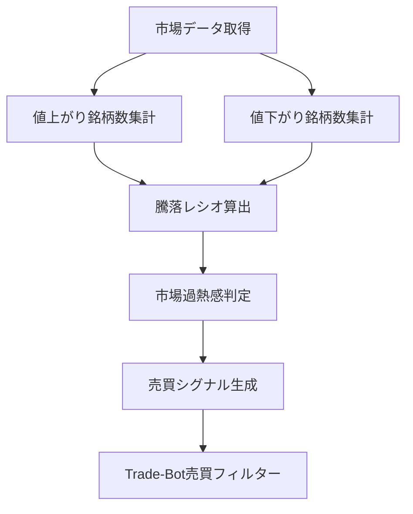

# 騰落レシオ

## 概要

騰落レシオ（Advance-Decline Ratio）は、市場全体の過熱感を判断するためのテクニカル指標です。

個別銘柄の株価ではなく、

* 値上がり銘柄数
* 値下がり銘柄数

を集計して算出するため、市場全体にどれだけ買いが集まっているか、あるいは売りが集まっているかを把握できます。

日本市場では特に有名な市場分析系指標であり、

* 東証プライム市場
* 東証全市場

などを対象として利用されることが多いです。

Trade-Botでは個別銘柄の売買判断というより、

「現在の市場環境を判定するフィルター」

として利用価値があります。

---

## この指標でわかること

### トレンド

市場全体の上昇トレンド・下降トレンドを把握できます。

例えば日経平均が上昇していても、

* 一部大型株だけが上昇している

のか、

* 市場全体が上昇している

のかを判断できます。

---

### 過熱感

騰落レシオの最も重要な用途です。

一般的には

* 120%以上 → 過熱気味
* 130%以上 → 買われすぎ
* 70%以下 → 売られすぎ

と判断されることがあります。

---

### ボラティリティ

直接的には判断できません。

ATRやボリンジャーバンドなどの指標が適しています。

---

### 投資家心理

市場参加者全体が

* 強気
* 弱気

どちらに傾いているかを把握できます。

騰落レシオが高い状態は、

「多くの投資家が買いに向かっている状態」

を意味します。

---

## 算出方法

### 計算式

一般的には25日騰落レシオが利用されます。

```text id="kij8r7"
騰落レシオ

= 過去25日間の値上がり銘柄数合計
  ÷
  過去25日間の値下がり銘柄数合計

× 100
```

---

### 計算例

過去25営業日の集計結果

```text id="g7yt3j"
値上がり銘柄数合計

25,000

値下がり銘柄数合計

20,000
```

の場合

```text id="zj3v7n"
25,000 ÷ 20,000 × 100

= 125%
```

騰落レシオは125%となります。

市場全体がやや過熱している状態と判断できます。

---

## 基本的な見方

### 70%以下

売られすぎ

市場全体が悲観的になっている可能性があります。

---

### 80〜120%

正常範囲

比較的安定した市場状態です。

---

### 120%以上

過熱気味

利益確定売りに注意が必要です。

---

### 130%以上

買われすぎ

短期的な調整が発生しやすくなります。

---

## チャートで見る代表的なシグナル

### 売られすぎ（買い候補）

騰落レシオが70%以下

市場全体が悲観状態になっている可能性があります。

参照画像

```text id="q83dke"
images/advance-decline-oversold.png
```

---

### 買われすぎ（売り警戒）

騰落レシオが130%以上

市場全体が楽観状態になっている可能性があります。

参照画像

```text id="h9dk2q"
images/advance-decline-overbought.png
```

---

### トレンド継続

騰落レシオが100%以上を維持

市場全体に買いが継続している状態です。

参照画像

```text id="vq0k28"
images/advance-decline-trend.png
```

---

### ダマシ

強い上昇相場では

130%以上でもさらに上昇する場合があります。

逆に、

70%以下でも下落が続く場合があります。

参照画像

```text id="z3ytv5"
images/advance-decline-fakeout.png
```

---

## 有効な相場

### 上昇相場

◎

市場全体の過熱感を判断できます。

---

### 下降相場

◎

市場全体の悲観状態を判断できます。

---

### レンジ相場

○

相場全体の方向感確認に利用できます。

---

## 組み合わせると良い指標

### RSI

個別銘柄の過熱感を確認できます。

---

### MACD

トレンド転換の確認に利用できます。

---

### 出来高

市場参加者の勢いを確認できます。

---

### 日経平均株価

指数との乖離分析が可能です。

---

### TOPIX

市場全体との整合性確認ができます。

---

## Trade-Bot実装観点

### 必要データ

* 値上がり銘柄数
* 値下がり銘柄数
* 市場銘柄数

---

### 算出頻度

* 日次

※デイトレード向け指標ではありません。

---

### 実装難易度

★★★☆☆

個別銘柄データではなく市場全体データが必要です。

---

### シグナル化候補

* 騰落レシオ130%以上で新規買い停止
* 騰落レシオ70%以下で買い候補抽出
* 市場フィルターとして利用
* リスクオン／リスクオフ判定

---

## Mermaid図



---

## 注意点

騰落レシオは

「個別銘柄の売買タイミングを直接示す指標」

ではありません。

市場全体の状況を把握するための指標です。

また、

* 130%以上だから必ず下落する
* 70%以下だから必ず反発する

わけではありません。

強いトレンド相場では過熱状態が長期間続くことがあります。

---

## まとめ

騰落レシオは市場全体の過熱感を把握するための代表的な指標です。

特に

* 市場全体が買われすぎか
* 市場全体が売られすぎか

を判断するのに有効です。

Trade-Botでは単独売買シグナルとして利用するより、

「市場フィルター」

として利用することで効果を発揮します。

---

## 画像生成プロンプト

ファイル名

```text id="s7m4ke"
images/advance-decline-signals.png
```

プロンプト

```text id="j7v4cn"
日本株の初心者向け投資教材。

白背景。

上段に日経平均チャート、
下段に騰落レシオチャートを表示。

以下を日本語ラベル付きで解説。

・70%以下（売られすぎ）
・100%（中立）
・120%（過熱気味）
・130%以上（買われすぎ）
・市場全体の強気相場
・市場全体の弱気相場
・ダマシ事例

矢印と吹き出しで説明を追加。

「市場全体が売られすぎ」
「反発が期待される局面」
「市場全体が過熱」
「利益確定売りに注意」

初心者向け教材。
書籍掲載レベルの高解像度チャート。
```
