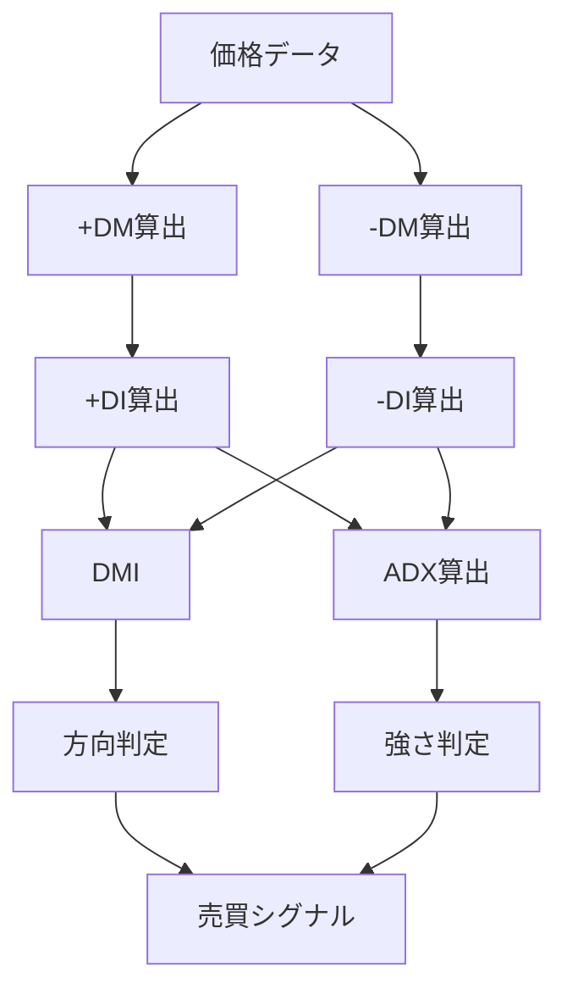
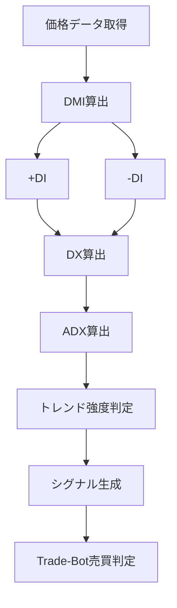

# ADX（Average Directional Index）

## 概要

ADX（Average Directional Index）は、

**現在のトレンドがどれくらい強いのか**

を数値化するテクニカル指標です。

ただし、ADXを理解するには、まずDMIを知る必要があります。

DMI（Directional Movement Index）は、

- +DI（買い勢力の強さ）
- -DI（売り勢力の強さ）

からトレンドの方向を判断する指標です。

例えば、

```text
+DI = 40
-DI = 20
```

の場合は、

```text
買い勢力が強い
↓
上昇トレンド
```

と判断します。

逆に、

```text
+DI = 15
-DI = 35
```

の場合は、

```text
売り勢力が強い
↓
下降トレンド
```

と判断します。

しかしDMIだけでは、

```text
上昇トレンドなのは分かる

↓

そのトレンドが強いのか弱いのか分からない
```

という問題があります。

そこで利用するのがADXです。

ADXは、

```text
+DI と -DI の差
```

から、

**トレンドの強さ**

を計算します。

つまり、

| 指標 | 分かること |
|------|------|
| DMI | トレンドの方向 |
| ADX | トレンドの強さ |

という役割になります。

Trade-Botでは、

「今の相場は売買すべきトレンド相場なのか」

を判定するフィルターとして非常に有効です。

---
## +DIと-DIとは

ADXを理解する前に、

まず

- +DI
- -DI

を理解する必要があります。

DMIでは、

「前日と比べて上方向・下方向のどちらに強く動いたか」

を計算します。

### 具体例

前日

```text
高値 = 100円
安値 = 90円
```

当日

```text
高値 = 110円
安値 = 95円
```

だったとします。

まず高値の伸びを計算します。

```text
110 - 100

= 10
```

次に安値の変化を計算します。

```text
90 - 95

= -5
```

この場合、

```text
上方向への値動き = 10

下方向への値動き = 5
```

となります。

上方向への値動きの方が大きいため、

```text
+DM = 10

-DM = 0
```

となります。

逆に、

下方向への値動きの方が大きければ、

```text
+DM = 0

-DM = 下方向への値動き
```

になります。

---

### +DMと-DMとは

| 指標 | 意味 |
|--------|--------|
| +DM | 上方向へどれだけ強く動いたか |
| -DM | 下方向へどれだけ強く動いたか |

まだこの段階では単なる値動き量です。

---

### +DIと-DIとは

+DMと-DMを一定期間集計して正規化したものが

- +DI
- -DI

です。

イメージとしては、

| 指標 | 意味 |
|--------|--------|
| +DI | 買い勢力の強さ |
| -DI | 売り勢力の強さ |

になります。

一般的には0〜100の範囲で推移します。

例えば、

```text
+DI = 40

-DI = 20
```

なら

```text
買い勢力が強い
```

ことを意味します。

逆に

```text
+DI = 15

-DI = 35
```

なら

```text
売り勢力が強い
```

ことを意味します。

---

## DMIとは

DMI（Directional Movement Index）は、

+DIと-DIを比較して

トレンドの方向を判断する指標です。

### 上昇トレンド

```text
+DI > -DI
```

買い勢力が優勢

↓

上昇トレンド

---

### 下降トレンド

```text
-DI > +DI
```

売り勢力が優勢

↓

下降トレンド

---

### 例①

```text
+DI = 40

-DI = 20
```

↓

上昇トレンド

---

### 例②

```text
+DI = 15

-DI = 35
```

↓

下降トレンド

---

しかし、

DMIだけでは

```text
トレンドの方向
```

は分かっても、

```text
トレンドの強さ
```

までは分かりません。

---

## ADXとは

ADX（Average Directional Index）は、

+DIと-DIの差を利用して

トレンドの強さ

を数値化した指標です。

### イメージ

```text
+DI = 21

-DI = 20
```

↓

差が小さい

↓

ADX低い

↓

トレンド弱い

---

```text
+DI = 50

-DI = 10
```

↓

差が大きい

↓

ADX高い

↓

強い上昇トレンド

---

```text
+DI = 10

-DI = 50
```

↓

差が大きい

↓

ADX高い

↓

強い下降トレンド


つまり、

| 指標 | 分かること |
|--------|--------|
| +DI | 買い勢力の強さ |
| -DI | 売り勢力の強さ |
| DMI | トレンドの方向 |
| ADX | トレンドの強さ |

という関係になります。

---

## 全体像


---

## DMIとADXの関係

イメージすると次のようになります。

```text
買い勢力（+DI）
      ↓
      ├─ 差が大きい ──→ ADX高い
      ↓
売り勢力（-DI）
```

### ケース① 強い上昇トレンド

```text
+DI = 50
-DI = 10
```

```text
買い勢力が圧倒的

↓

ADX高い

↓

強い上昇トレンド
```

### ケース② 強い下降トレンド

```text
+DI = 10
-DI = 50
```

```text
売り勢力が圧倒的

↓

ADX高い

↓

強い下降トレンド
```

### ケース③ レンジ相場

```text
+DI = 22
-DI = 20
```

```text
買い勢力と売り勢力が拮抗

↓

ADX低い

↓

トレンドなし
```

---

## この指標でわかること

### トレンド

ADXの最も重要な役割です。

一般的な目安

| ADX | 状態 |
|------|------|
| 20未満 | トレンドなし |
| 20〜25 | トレンド発生の兆候 |
| 25〜40 | 明確なトレンド |
| 40以上 | 強いトレンド |
| 50以上 | 非常に強いトレンド |

### 過熱感

直接判断することはできません。

RSIやストキャスティクスが適しています。

### ボラティリティ

直接判断する指標ではありません。

ATRやボリンジャーバンドの利用が推奨されます。

### 投資家心理

ADX上昇

↓

トレンド方向への参加者増加

↓

市場参加者の意見が一致

↓

強いトレンド形成

という流れを把握できます。

---

## 算出方法

### 計算式

ADXはDMIから算出されます。

計算の流れ

```text
価格データ

↓

+DI算出
-DI算出

↓

DX算出

DX = |(+DI - -DI)| ÷ (+DI + -DI) × 100

↓

ADX算出

ADX = DXの移動平均
```

### 計算例

```text
+DI = 40
-DI = 20
```

の場合

```text
DX

= |40 - 20| ÷ (40 + 20)

= 20 ÷ 60

= 0.333

= 33.3
```

このDXを一定期間平均化したものがADXです。

---

## 基本的な見方

### ADX上昇

トレンドが強くなっている

### ADX下降

トレンドが弱くなっている

### ADX 20未満

レンジ相場の可能性

### ADX 25以上

トレンド相場の可能性

### ADX 40以上

強いトレンド

---

## 初心者が最初に覚えるべきポイント

ADXを見るときは、

```text
ADXだけ見ない
```

ことが重要です。

必ず

```text
+DI
-DI
ADX
```

をセットで確認します。

判断方法は次の通りです。

| 状況 | 判断 |
|------|------|
| +DI > -DI かつ ADX上昇 | 強い上昇トレンド |
| -DI > +DI かつ ADX上昇 | 強い下降トレンド |
| ADX < 20 | レンジ相場 |
| ADX下降 | トレンド弱体化 |

---

## チャートで見る代表的なシグナル

### 買いシグナル

ADX単体では買いシグナルになりません。

一般的には

```text
+DI > -DI

かつ

ADX上昇
```

で買い候補となります。

参照画像

```text
images/adx-buy-signal.png
```

### 売りシグナル

```text
-DI > +DI

かつ

ADX上昇
```

の場合です。

下降トレンドが強まっている可能性があります。

参照画像

```text
images/adx-sell-signal.png
```

### トレンド継続

ADXが上昇し続けている状態です。

上昇・下降どちらの方向でも発生します。

参照画像

```text
images/adx-trend-follow.png
```

### ダマシ

ADX上昇前にエントリーすると、

レンジ相場で損失になる場合があります。

参照画像

```text
images/adx-fakeout.png
```

---

## 有効な相場

### 上昇相場

◎

トレンド強度判定に有効

### 下降相場

◎

トレンド強度判定に有効

### レンジ相場

○

トレンドがないことを確認できる

---

## 組み合わせると良い指標

### DMI

最重要

ADXはDMIとセットで利用します。

### 移動平均線（SMA）

トレンド方向確認

### MACD

トレンド転換確認

### RSI

過熱感確認

### 出来高

トレンド信頼性確認

---

## Trade-Bot実装観点

### 必要データ

- 高値
- 安値
- 終値

### 算出頻度

- Tick
- 1分足
- 5分足
- 日足

### 実装難易度

★★★☆☆

DMI実装後であれば比較的容易です。

### シグナル化候補

#### トレンド相場判定

```text
ADX > 25
```

#### レンジ相場判定

```text
ADX < 20
```

#### 買いシグナル

```text
+DI > -DI

かつ

ADX上昇
```

#### 売りシグナル

```text
-DI > +DI

かつ

ADX上昇
```

---

## Mermaid図



---

## 注意点

ADXは

```text
上昇している

＝ 株価が上昇している
```

ではありません。

下降トレンドでもADXは上昇します。

ADXが示しているのは

```text
方向

ではなく

強さ
```

です。

初心者が最も勘違いしやすいポイントです。

---

## まとめ

ADXは

- トレンドの方向

ではなく

- トレンドの強さ

を判断する指標です。

単独利用ではなく、

- DMI
- SMA
- MACD

などと組み合わせることで真価を発揮します。

Trade-Botでは、

「トレンド相場だけ売買する」

ためのフィルターとして非常に有効な指標です。
