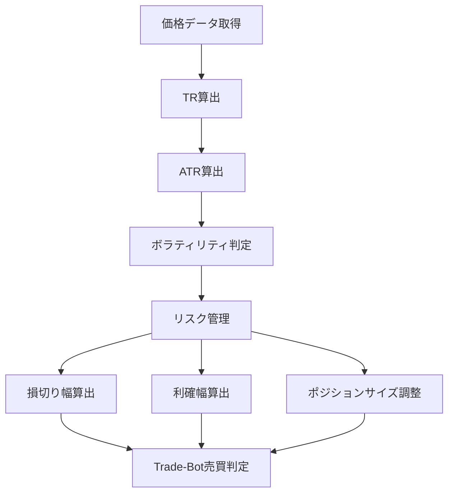

# ATR（Average True Range）

## 概要

ATR（Average True Range）は、株価がどれくらい大きく動いているかを数値化したテクニカル指標です。

日本語では

* 平均真の値幅
* 平均変動幅

などと呼ばれます。

ATRは

「上がるか下がるか」

を判断する指標ではなく、

**「どれくらい激しく動いているか」**

を判断するための指標です。

そのため、

* 売買タイミングの判断
* 損切りライン設定
* 利確ライン設定
* ポジションサイズ管理

などに幅広く利用されています。

Trade-Botにおいても、

売買シグナルというより

**リスク管理のための重要指標**

として利用価値があります。

---

## この指標でわかること

### トレンド

直接判断することはできません。

ATRが上昇していても

* 上昇トレンド
* 下降トレンド

のどちらでも発生します。

方向性の判断には

* SMA
* EMA
* MACD
* DMI

などを利用します。

---

### 過熱感

直接判断することはできません。

RSIやストキャスティクスが適しています。

---

### ボラティリティ

ATRの最も重要な用途です。

ATR上昇

↓

値動きが大きい

↓

ボラティリティ上昇

ATR下降

↓

値動きが小さい

↓

ボラティリティ低下

を意味します。

---

### 投資家心理

ATRが急上昇している場合、

市場参加者の間で

* 強気
* 弱気

の意見が大きくぶつかっている可能性があります。

重要イベント後や決算発表後によく見られます。

---

## 算出方法

### 計算式

まずTrue Range（TR）を算出します。

```text id="7w5s2e"
TR = 以下の最大値

① 当日高値 - 当日安値

② |当日高値 - 前日終値|

③ |当日安値 - 前日終値|
```

---

その後、

```text id="f5m8ju"
ATR = TRの移動平均
```

を算出します。

一般的には14期間ATRが利用されます。

---

### 計算例

```text id="24qop3"
前日終値 = 1000円

当日高値 = 1050円

当日安値 = 980円
```

計算

```text id="pt26m8"
① 1050 - 980 = 70

② |1050 - 1000| = 50

③ |980 - 1000| = 20
```

最大値は

```text id="olpqzz"
70
```

したがって

```text id="1m12ns"
TR = 70
```

になります。

このTRの平均値がATRです。

---

## 基本的な見方

### ATR上昇

ボラティリティ上昇

市場が活発

---

### ATR下降

ボラティリティ低下

市場が静か

---

### ATR急上昇

重要イベント発生

決算発表

ニュース

急騰・急落

などの可能性があります。

---

### ATR低下

レンジ相場や膠着状態が続いている可能性があります。

---

## チャートで見る代表的なシグナル

### ブレイクアウト前兆

ATRが長期間低下

↓

急上昇

↓

大きな値動き発生

参照画像

```text id="4s1g6h"
images/atr-breakout.png
```

---

### トレンド継続

ATR上昇を伴うトレンド

↓

市場参加者増加

↓

トレンド継続しやすい

参照画像

```text id="b5v34o"
images/atr-trend-follow.png
```

---

### 相場終了の兆候

ATR低下

↓

参加者減少

↓

トレンド終了の可能性

参照画像

```text id="pn9uzx"
images/atr-trend-end.png
```

---

### ダマシ

ATR上昇だけでは方向性は判断できません。

ATRだけで売買すると失敗する可能性があります。

参照画像

```text id="6mkd6z"
images/atr-fakeout.png
```

---

## 有効な相場

### 上昇相場

◎

リスク管理に有効

---

### 下降相場

◎

リスク管理に有効

---

### レンジ相場

◎

ボラティリティ分析に有効

---

## 組み合わせると良い指標

### SMA

トレンド方向確認

---

### EMA

短期トレンド確認

---

### MACD

トレンド転換確認

---

### DMI・ADX

トレンド強度確認

---

### ボリンジャーバンド

ボラティリティ分析の精度向上

---

## Trade-Bot実装観点

### 必要データ

* 高値
* 安値
* 終値

---

### 算出頻度

* Tick
* 1分足
* 5分足
* 日足

---

### 実装難易度

★★☆☆☆

比較的容易

---

### シグナル化候補

#### ATR急上昇

```text id="zkvfh9"
ATR > ATR移動平均
```

---

#### ボラティリティ低下

```text id="ncp3so"
ATR < ATR移動平均
```

---

#### 損切り設定

```text id="kr0gyr"
損切り = 2ATR
```

---

#### 利確設定

```text id="6q5s8l"
利確 = 3ATR
```

---

#### ポジションサイズ調整

```text id="5g1bjm"
ATR上昇

↓

ロット縮小
```

---

## Mermaid図



---

## 注意点

ATRは

```text id="c3l9wa"
方向性を示さない
```

指標です。

ATR上昇

↓

株価上昇

ではありません。

ATR上昇

↓

値動きが大きい

だけを意味します。

初心者が最も勘違いしやすいポイントです。

---

## まとめ

ATRは

* トレンド
* 過熱感

を判断する指標ではなく、

**値動きの大きさ（ボラティリティ）**

を判断する指標です。

Trade-Botでは

* 損切り設定
* 利確設定
* ロット管理
* ボラティリティフィルター

として活用すると非常に効果的です。

単独売買シグナルよりも、

リスク管理用途で真価を発揮する指標です。

---

## 画像生成プロンプト

ファイル名

```text id="6m85s4"
images/atr-signals.png
```

プロンプト

```text id="ef2mpn"
日本株の初心者向け教材。

白背景。

上段にローソク足チャート。

下段にATRチャート。

以下を日本語ラベル付きで表示。

・ATR上昇
・ATR下降
・ボラティリティ拡大
・ボラティリティ縮小
・ブレイクアウト前兆
・トレンド継続
・ATRを利用した損切りライン
・ATRを利用した利確ライン
・ダマシ事例

矢印と吹き出しで解説。

「値動き拡大」
「値動き縮小」
「損切り幅の目安」
「大きな相場変動発生」

初心者向け教材。
書籍掲載レベル。
高解像度。
```
