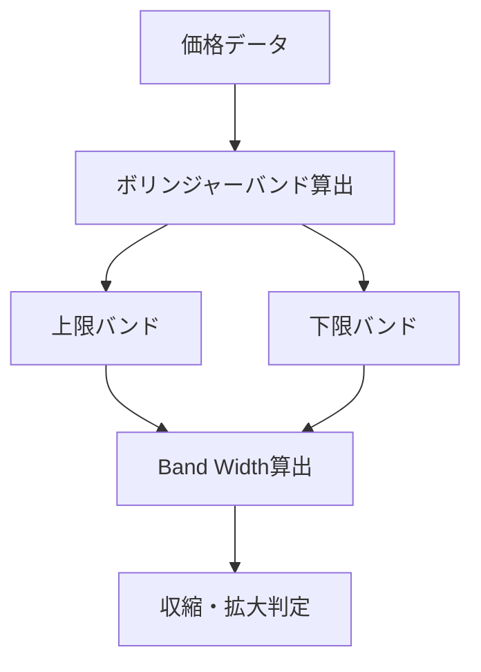
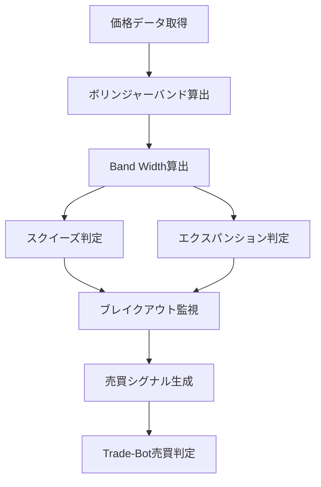

# Band Width

## 概要

Band Width（バンド幅）は、

ボリンジャーバンドの上下バンド間の距離を数値化した指標です。

ボリンジャーバンドは、

- 中心線（移動平均線）
- 上限バンド（+2σ）
- 下限バンド（-2σ）

で構成されています。

Band Widthは、

```text
上限バンドと下限バンドがどれくらい離れているか
```

を表します。

つまり、

```text
Band Widthが小さい

↓

値動きが小さい

↓

相場が静か
```

```text
Band Widthが大きい

↓

値動きが大きい

↓

相場が活発
```

を意味します。

特に、

```text
スクイーズ（収縮）

↓

エクスパンション（拡大）
```

を発見するために利用されます。

ブレイクアウト手法では非常に人気の高い指標です。

---

## この指標でわかること

### トレンド

直接的なトレンド方向は判断できません。

ただし、

Band Widthの拡大は

```text
強いトレンド発生
```

の前兆になる場合があります。

---

### 過熱感

判断できません。

RSIやストキャスティクスが適しています。

---

### ボラティリティ

Band Widthの最も重要な役割です。

```text
Band Width上昇

↓

ボラティリティ上昇
```

```text
Band Width下降

↓

ボラティリティ低下
```

を意味します。

---

### 投資家心理

Band Width縮小

↓

市場参加者が様子見

↓

方向感がない

---

Band Width拡大

↓

市場参加者が一方向へ動き始める

↓

トレンド発生

を意味します。

---

## 算出方法

### 計算式

一般的な計算式

```text
Band Width

= (上限バンド - 下限バンド)

÷ 中心線
```

---

### ボリンジャーバンドの構成

```text
中心線 = SMA20

上限バンド = SMA20 + 2σ

下限バンド = SMA20 - 2σ
```

---

### 計算例

```text
中心線 = 100円

上限バンド = 110円

下限バンド = 90円
```

の場合

```text
Band Width

= (110 - 90) ÷ 100

= 20 ÷ 100

= 0.20
```

となります。

---

## 基本的な見方

### Band Width低下

ボラティリティ縮小

---

### Band Width上昇

ボラティリティ拡大

---

### Band Widthが極端に低い

スクイーズ

---

### Band Width急上昇

エクスパンション

---

## Band Widthとボリンジャーバンドの関係

Band Widthは、

ボリンジャーバンドから算出される補助指標です。

```text
ボリンジャーバンド

↓

上下バンド間距離を計算

↓

Band Width
```

という関係になります。



---

## チャートで見る代表的なシグナル

### スクイーズ（収縮）

Band Widthが低下し続ける状態です。

```text
値動きが小さい

↓

エネルギー蓄積

↓

大きな値動きの前兆
```

参照画像

```text
images/band-width-squeeze.png
```

---

### エクスパンション（拡大）

Band Widthが急上昇する状態です。

```text
ボラティリティ拡大

↓

トレンド発生
```

参照画像

```text
images/band-width-expansion.png
```

---

### 買いシグナル

Band Width単体では判断しません。

一般的には

```text
スクイーズ

↓

上方向ブレイクアウト

↓

Band Width上昇
```

で買い候補になります。

参照画像

```text
images/band-width-buy.png
```

---

### 売りシグナル

```text
スクイーズ

↓

下方向ブレイクアウト

↓

Band Width上昇
```

の場合です。

参照画像

```text
images/band-width-sell.png
```

---

### ダマシ

スクイーズ後に一瞬だけブレイクし、

すぐレンジへ戻るケースです。

Band Widthだけで判断すると発生しやすくなります。

参照画像

```text
images/band-width-fakeout.png
```

---

## 有効な相場

### 上昇相場

○

トレンド発生検知に有効

---

### 下降相場

○

トレンド発生検知に有効

---

### レンジ相場

◎

スクイーズ発見に有効

---

### ブレイクアウト相場

◎

最も有効

---

## 組み合わせると良い指標

### ボリンジャーバンド

最重要

Band Widthはボリンジャーバンドの補助指標です。

---

### 出来高

ブレイクアウトの信頼性確認

---

### RSI

過熱感確認

---

### MACD

トレンド発生確認

---

### 移動平均線（SMA）

方向性確認

---

## Trade-Bot実装観点

### 必要データ

- 終値

---

### 算出頻度

- Tick
- 1分足
- 5分足
- 日足

---

### 実装難易度

★★☆☆☆

ボリンジャーバンド実装後であれば容易です。

---

### シグナル化候補

#### スクイーズ検知

```text
Band Widthが過去20期間最低
```

---

#### エクスパンション検知

```text
Band Width急上昇
```

---

#### 買いシグナル

```text
スクイーズ

かつ

上方向ブレイクアウト
```

---

#### 売りシグナル

```text
スクイーズ

かつ

下方向ブレイクアウト
```

---

## Mermaid図



---

## 注意点

Band Widthは

```text
上昇

＝ 株価上昇
```

ではありません。

Band Widthが示しているのは

```text
方向

ではなく

値動きの大きさ
```

です。

上昇トレンドでも下降トレンドでも

Band Widthは上昇します。

方向判断には

- ボリンジャーバンド
- SMA
- MACD

などを併用しましょう。

---

## まとめ

Band Widthは、

ボリンジャーバンドの幅を利用して

市場のボラティリティを測定する指標です。

特に

- スクイーズ
- エクスパンション
- ブレイクアウト

を発見するために有効です。

Trade-Botでは、

「大きな値動きが始まりそうなタイミング」

を検出するためのフィルターとして活用できます。
