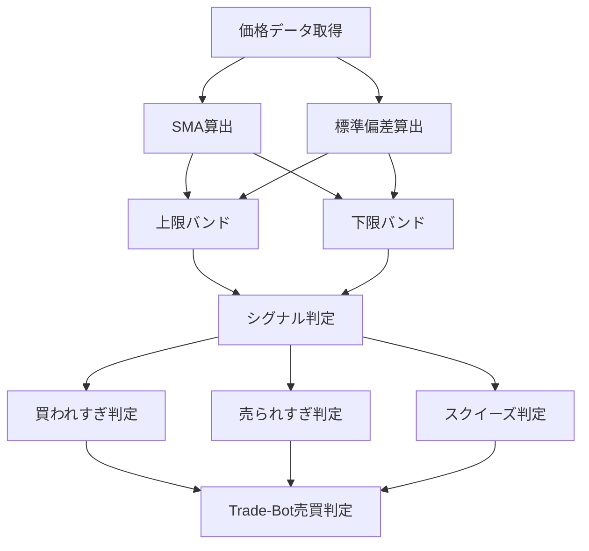

# ボリンジャーバンド（Bollinger Bands）

## 概要

ボリンジャーバンドは、

価格がどの程度の範囲で変動しているのかを可視化するためのテクニカル指標です。

アメリカの投資アナリストである
**ジョン・ボリンジャー（John Bollinger）**
によって考案されました。

ボリンジャーバンドは、

- 移動平均線
- 標準偏差（σ）

を利用して構成されます。

一般的には

```text
中心線（20日移動平均線）

+1σ
-1σ

+2σ
-2σ

+3σ
-3σ
```

が表示されます。

ボリンジャーバンドを見ることで、

```text
現在価格が高すぎるのか

安すぎるのか

それとも適正価格付近なのか
```

を判断できます。

また、

```text
値動きが小さい状態

↓

大きな値動きが発生する前兆
```

も発見できます。

そのため、

個人投資家から機関投資家まで非常に利用者が多い指標です。

---

## ボリンジャーバンドの構成

```text
+3σ

+2σ

+1σ

中心線（20日移動平均線）

-1σ

-2σ

-3σ
```

### 中心線

一般的には20期間移動平均線（SMA20）

---

### σ（シグマ）

標準偏差

価格のばらつき

を表します。

---

### ±2σの意味

統計学上、

価格が正規分布すると仮定した場合、

```text
約95%

の価格が

±2σ内に収まる
```

と言われています。

つまり、

```text
+2σを超える

↓

かなり強い上昇
```

```text
-2σを超える

↓

かなり強い下落
```

を意味します。

---

## この指標でわかること

### トレンド

価格が

```text
+2σ沿いに推移
```

している場合、

強い上昇トレンド

---

```text
-2σ沿いに推移
```

している場合、

強い下降トレンド

を判断できます。

---

### 過熱感

最も得意な分析です。

```text
+2σ突破

↓

買われすぎの可能性
```

```text
-2σ突破

↓

売られすぎの可能性
```

を示します。

---

### ボラティリティ

ボリンジャーバンドの幅を見ることで判断できます。

```text
バンド幅が狭い

↓

ボラティリティ低い
```

```text
バンド幅が広い

↓

ボラティリティ高い
```

---

### 投資家心理

バンド幅が縮小すると

```text
様子見状態
```

になります。

バンド幅が急拡大すると

```text
参加者が一方向へ動き始めた
```

ことを意味します。

---

## 算出方法

### 計算式

中心線

```text
SMA20
```

上限バンド

```text
SMA20 + (標準偏差 × 2)
```

下限バンド

```text
SMA20 - (標準偏差 × 2)
```

---

### 計算例

```text
20日移動平均

100円
```

```text
標準偏差

5円
```

の場合

上限バンド

```text
100 + (5 × 2)

= 110円
```

下限バンド

```text
100 - (5 × 2)

= 90円
```

となります。

---

## 基本的な見方

### 中心線付近

適正価格帯

---

### +2σ接近

上昇圧力強い

---

### -2σ接近

下落圧力強い

---

### バンド幅縮小

スクイーズ

---

### バンド幅拡大

エクスパンション

---

## 初心者が最初に覚えるべきポイント

初心者はまず以下の3つを覚えましょう。

### ① +2σ到達

```text
買われすぎの可能性
```

---

### ② -2σ到達

```text
売られすぎの可能性
```

---

### ③ スクイーズ

```text
大きな値動きの前兆
```

---

## チャートで見る代表的なシグナル

### 買われすぎ

価格が

```text
+2σ

または

+3σ
```

へ到達

↓

短期的に上昇しすぎ

参照画像

```text
images/bollinger-overbought.png
```

---

### 売られすぎ

価格が

```text
-2σ

または

-3σ
```

へ到達

↓

短期的に下落しすぎ

参照画像

```text
images/bollinger-oversold.png
```

---

### バンドウォーク

価格が

```text
+2σ沿い
```

を継続して推移

↓

強い上昇トレンド

参照画像

```text
images/bollinger-bandwalk.png
```

---

### スクイーズ

バンド幅が極端に縮小

↓

エネルギー蓄積

↓

ブレイクアウト前兆

参照画像

```text
images/bollinger-squeeze.png
```

---

### エクスパンション

バンド幅急拡大

↓

トレンド発生

参照画像

```text
images/bollinger-expansion.png
```

---

### ダマシ

+2σ到達後すぐ反落

または

-2σ到達後すぐ反発

参照画像

```text
images/bollinger-fakeout.png
```

---

## 有効な相場

### 上昇相場

○

バンドウォーク確認

---

### 下降相場

○

下降トレンド確認

---

### レンジ相場

◎

最も得意

逆張りで利用されることが多い

---

### ブレイクアウト相場

◎

スクイーズからの拡大検知

---

## 組み合わせると良い指標

### RSI

最重要

過熱感確認

---

### MACD

トレンド転換確認

---

### 出来高

シグナル信頼性向上

---

### SMA

長期トレンド確認

---

### Band Width

スクイーズ判定

---

## Trade-Bot実装観点

### 必要データ

- 終値

---

### 算出頻度

- Tick
- 1分足
- 5分足
- 日足

---

### 実装難易度

★★☆☆☆

標準偏差計算のみで実装可能

---

### シグナル化候補

#### 買い候補

```text
価格 <= -2σ

かつ

RSI < 30
```

---

#### 売り候補

```text
価格 >= +2σ

かつ

RSI > 70
```

---

#### ブレイクアウト検知

```text
スクイーズ

かつ

出来高増加
```

---

#### バンドウォーク検知

```text
連続して+2σ付近推移
```

---

## Mermaid図



---

## 注意点

初心者が最も誤解しやすいポイントは、

```text
+2σ到達

＝ 売り
```

ではない

ということです。

強いトレンド相場では

```text
+2σ沿いに上昇し続ける
```

ことがあります。

これを

```text
バンドウォーク
```

と呼びます。

そのため、

ボリンジャーバンド単体ではなく、

- RSI
- MACD
- 出来高

と組み合わせて判断することが重要です。

---
## バンドウォーク判定目安

明確な定義はありませんが、一般的には

「価格が連続して+2σ（または-2σ）付近を推移している状態」

をバンドウォークと呼びます。

### 目安

| 足種 | バンドウォーク判定目安 |
|------|------|
| 1分足 | 5〜10本以上 |
| 5分足 | 4〜8本以上 |
| 15分足 | 3〜6本以上 |
| 日足 | 3日以上 |

---

### Trade-Bot実装例

#### バンドウォーク開始

```text
直近5本中

4本以上が

+2σ以上
```

または

```text
直近5本中

4本以上が

-2σ以下
```

---

#### バンドウォーク継続

```text
価格が継続して

+2σ付近

または

-2σ付近

を推移
```

---

#### バンドウォーク終了

```text
2本連続で

+2σを下抜け
```

または

```text
2本連続で

-2σを上抜け
```

---

### シグナル例

#### 順張り買い

```text
バンドウォーク開始

かつ

出来高増加
```

---

#### 利確シグナル

```text
バンドウォーク終了
```

---

#### 売りシグナル

```text
上昇バンドウォーク終了

かつ

RSI低下
```

---

### 注意点

```text
+2σ到達

＝ 売り
```

ではありません。

強い上昇相場では

```text
+2σ沿い

または

+3σ沿い
```

を数日〜数週間継続することがあります。

そのため、

- RSI
- MACD
- 出来高

と組み合わせて判断することが重要です。
---

## まとめ

ボリンジャーバンドは、

- 過熱感
- ボラティリティ
- トレンド継続
- ブレイクアウト予兆

を把握できる非常に万能な指標です。

Trade-Botでは、

- 逆張り戦略
- ブレイクアウト戦略
- ボラティリティ監視

など様々な売買ロジックに利用できます。
