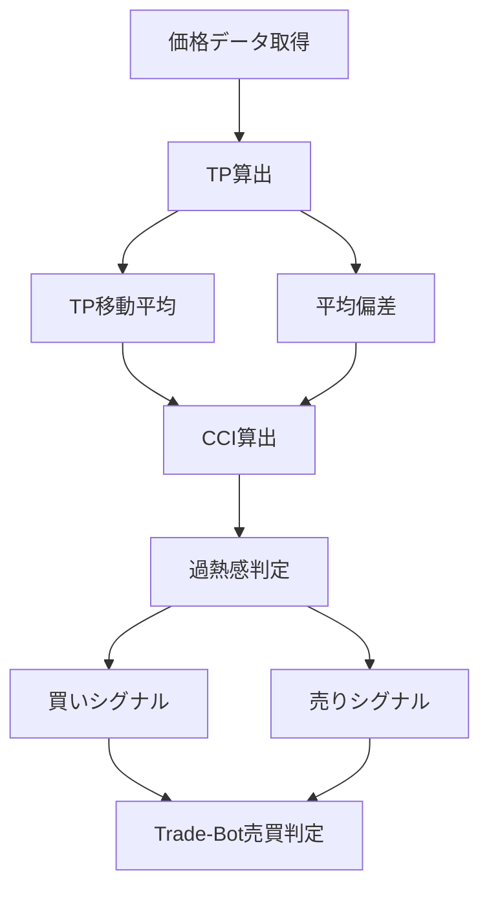

# CCI（Commodity Channel Index）

## 概要

CCI（Commodity Channel Index）は、

現在の価格が

```text
平均価格からどれくらい離れているか
```

を数値化したテクニカル指標です。

名前に「Commodity（商品）」と付いていますが、

現在では

- 株式
- FX
- 仮想通貨
- 先物

など幅広い市場で利用されています。

CCIは、

価格が平均から大きく離れた状態を検知し、

```text
買われすぎ

売られすぎ
```

を判断するために利用されます。

また、

一般的なオシレーター系指標と違い、

```text
上限100

下限0
```

のような固定範囲がありません。

そのため、

強いトレンド相場では

CCIが高いまま推移することもあります。

---

## CCIの考え方

CCIは非常にシンプルです。

```text
平均価格から近い

↓

CCI小さい

↓

平常状態
```

---

```text
平均価格から大きく上に離れる

↓

CCI大きくプラス

↓

買われすぎ
```

---

```text
平均価格から大きく下に離れる

↓

CCI大きくマイナス

↓

売られすぎ
```

---

つまり、

CCIは

```text
価格の異常値
```

を検出するための指標です。

---

## この指標でわかること

### トレンド

CCI上昇

↓

上昇トレンド強化

---

CCI下降

↓

下降トレンド強化

---

### 過熱感

CCIの最も重要な役割です。

一般的な目安

| CCI | 状態 |
|------|------|
| +100以上 | 買われすぎ |
| +200以上 | 非常に強い上昇 |
| -100以下 | 売られすぎ |
| -200以下 | 非常に強い下落 |

---

### ボラティリティ

CCIの振れ幅が大きいほど

価格変動が大きい状態を意味します。

---

### 投資家心理

CCI急上昇

↓

買いが集中

↓

強気相場

---

CCI急下降

↓

売りが集中

↓

弱気相場

---

## 算出方法

### CCI計算の流れ

まず代表価格（TP）を求めます。

### TP（Typical Price）

```text
TP

= (高値 + 安値 + 終値)

÷ 3
```

---

### 移動平均

TPの移動平均を計算

```text
TP平均
```

---

### 平均偏差

```text
TPとTP平均の差の平均
```

を求めます。

---

### CCI

```text
CCI

= (TP − TP平均)

÷ (0.015 × 平均偏差)
```

---

### 計算例

```text
高値 = 110

安値 = 90

終値 = 100
```

---

代表価格

```text
TP

= (110 + 90 + 100)

÷ 3

= 100
```

---

TP平均

```text
95
```

---

平均偏差

```text
3
```

の場合

```text
CCI

= (100 - 95)

÷ (0.015 × 3)

= 111.1
```

となります。

---

## 基本的な見方

### CCI > +100

買われすぎ

---

### CCI < -100

売られすぎ

---

### CCI > +200

強い上昇トレンド

---

### CCI < -200

強い下降トレンド

---

### CCIが0付近

平均価格付近

---

## 初心者が最初に覚えるべきポイント

まずは以下だけ覚えれば十分です。

| CCI | 判断 |
|------|------|
| +100超え | 買われすぎ |
| -100割れ | 売られすぎ |
| 0付近 | 平均価格付近 |

---

## チャートで見る代表的なシグナル

### 買いシグナル

CCIが

```text
-100以下

↓

上向き反転
```

した場合

買い候補となります。

参照画像

```text
images/cci-buy-signal.png
```

---

### 売りシグナル

CCIが

```text
+100以上

↓

下向き反転
```

した場合

売り候補となります。

参照画像

```text
images/cci-sell-signal.png
```

---

### トレンド継続

CCIが

```text
+100以上
```

を維持

↓

上昇トレンド継続

---

CCIが

```text
-100以下
```

を維持

↓

下降トレンド継続

参照画像

```text
images/cci-trend-follow.png
```

---

### ダマシ

レンジ相場では

```text
+100

-100
```

を頻繁に行き来します。

そのため

CCI単体で売買すると

ダマシが発生しやすくなります。

参照画像

```text
images/cci-fakeout.png
```

---

## 有効な相場

### 上昇相場

○

トレンド確認に有効

---

### 下降相場

○

トレンド確認に有効

---

### レンジ相場

◎

逆張りで利用しやすい

---

### 急騰・急落相場

◎

過熱感把握に有効

---

## 組み合わせると良い指標

### 移動平均線（SMA）

最重要

トレンド方向確認

---

### RSI

過熱感確認

---

### MACD

トレンド転換確認

---

### ボリンジャーバンド

乖離確認

---

### 出来高

シグナル信頼性向上

---

## Trade-Bot実装観点

### 必要データ

- 高値
- 安値
- 終値

---

### 算出頻度

- Tick
- 1分足
- 5分足
- 日足

---

### 実装難易度

★★★☆☆

移動平均と平均偏差が必要

---

### シグナル化候補

#### 買い候補

```text
CCI < -100

かつ

上向き転換
```

---

#### 売り候補

```text
CCI > +100

かつ

下向き転換
```

---

#### トレンドフォロー

```text
CCI > +100
```

---

#### トレンドフォロー売り

```text
CCI < -100
```

---

## Mermaid図



---

## 注意点

初心者が最も勘違いしやすいのは

```text
CCI > +100

↓

必ず下落する
```

ではないことです。

強い上昇トレンドでは

CCIが

```text
+100以上
```

を長期間維持することがあります。

そのため

- 移動平均線
- MACD
- 出来高

などと組み合わせて判断することが重要です。

---

## まとめ

CCIは、

平均価格からの乖離を数値化し、

- 買われすぎ
- 売られすぎ
- トレンド継続

を判断できる指標です。

特に

- レンジ相場の逆張り
- トレンド相場の勢い確認

に有効です。

Trade-Botでは、

過熱感フィルターやエントリーシグナルとして活用できます。

---

## 画像生成プロンプト

ファイル名

```text
images/cci-signals.png
```

プロンプト

```text
日本株の初心者向け教材。

白背景。

上段にローソク足チャート。

下段にCCIチャート。

以下を日本語ラベル付きで表示。

・CCI +100
・CCI -100
・CCI +200
・CCI -200
・買われすぎ
・売られすぎ
・買いシグナル
・売りシグナル
・トレンド継続
・ダマシ

矢印と吹き出しで解説。

「平均価格から大きく上に乖離」
「買われすぎの可能性」
「売られすぎの可能性」
「強い上昇トレンド」
「強い下降トレンド」
「レンジ相場でのダマシ」

初心者向け教材。
書籍掲載レベル。
高解像度。
日本語表記。
```
