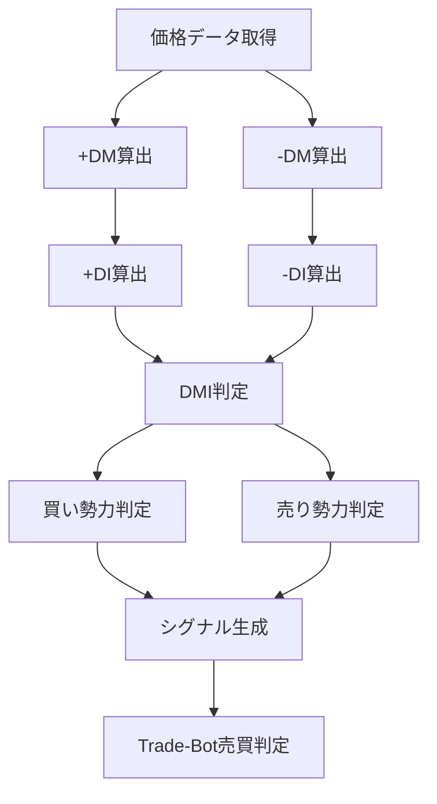

# DMI（Directional Movement Index）

## 概要

DMI（Directional Movement Index）は、

現在の相場が

```text
上昇トレンドなのか

下降トレンドなのか
```

を判断するためのテクニカル指標です。

DMIは

- +DI
- -DI

という2本の線で構成されています。

一般的には

```text
+DI > -DI

↓

上昇トレンド
```

```text
-DI > +DI

↓

下降トレンド
```

と判断します。

DMIは

```text
トレンドの方向
```

を判断する指標です。

一方で、

```text
トレンドの強さ
```

を判断するのは

```text
ADX
```

になります。

そのため、

実際のトレードでは

```text
DMI + ADX
```

をセットで利用することが一般的です。

---

## DMIの考え方

DMIは

```text
買い勢力

VS

売り勢力
```

を数値化しています。

---

### +DI

買い勢力

上方向への値動きの強さ

---

### -DI

売り勢力

下方向への値動きの強さ

---

例えば

```text
+DI = 40

-DI = 20
```

なら

```text
買い勢力優勢
```

となります。

---

逆に

```text
+DI = 15

-DI = 35
```

なら

```text
売り勢力優勢
```

となります。

---

## この指標でわかること

### トレンド

DMIの最も重要な役割です。

```text
+DI > -DI

↓

上昇トレンド
```

---

```text
-DI > +DI

↓

下降トレンド
```

---

### 過熱感

判断できません。

RSIやCCIが適しています。

---

### ボラティリティ

判断できません。

ATRやボリンジャーバンドが適しています。

---

### 投資家心理

```text
+DI上昇

↓

買い参加者増加
```

---

```text
-DI上昇

↓

売り参加者増加
```

を把握できます。

---

## 算出方法

### 計算の流れ

まず

```text
前日高値

前日安値
```

と比較して

当日の値動きを計算します。

---

### +DM

上方向への値動き

```text
当日高値 - 前日高値
```

---

### -DM

下方向への値動き

```text
前日安値 - 当日安値
```

---

### 具体例

前日

```text
高値 = 100

安値 = 90
```

当日

```text
高値 = 110

安値 = 95
```

の場合

```text
+DM

= 110 - 100

= 10
```

```text
-DM

= 90 - 95

= -5
```

---

上方向の値動きが大きいため

```text
+DM = 10

-DM = 0
```

になります。

---

その後、

一定期間平均化したものが

```text
+DI
```

```text
-DI
```

です。

---

## 基本的な見方

### +DI > -DI

上昇トレンド

---

### -DI > +DI

下降トレンド

---

### +DIと-DIがクロス

トレンド転換の可能性

---

### +DIと-DIの差が大きい

強いトレンドの可能性

---

## 初心者が最初に覚えるべきポイント

まずは以下だけ覚えれば十分です。

```text
+DIが上

↓

買い優勢

↓

上昇トレンド
```

---

```text
-DIが上

↓

売り優勢

↓

下降トレンド
```

---

```text
クロス

↓

トレンド転換候補
```

---

## チャートで見る代表的なシグナル

### 買いシグナル

```text
+DI

が

-DI

を上抜け
```

参照画像

```text
images/dmi-buy-signal.png
```

---

### 売りシグナル

```text
-DI

が

+DI

を上抜け
```

参照画像

```text
images/dmi-sell-signal.png
```

---

### トレンド継続

```text
+DI > -DI
```

継続

↓

上昇トレンド継続

---

```text
-DI > +DI
```

継続

↓

下降トレンド継続

参照画像

```text
images/dmi-trend-follow.png
```

---

### ダマシ

レンジ相場では

```text
+DI

-DI
```

が頻繁にクロスします。

参照画像

```text
images/dmi-fakeout.png
```

---

## 有効な相場

### 上昇相場

◎

方向判定に有効

---

### 下降相場

◎

方向判定に有効

---

### レンジ相場

△

ダマシが多い

---

## 組み合わせると良い指標

### ADX

最重要

方向 + 強さ

を同時に確認できる

---

### 移動平均線（SMA）

長期トレンド確認

---

### MACD

トレンド転換確認

---

### RSI

過熱感確認

---

### 出来高

シグナル信頼性向上

---

## Trade-Bot実装観点

### 必要データ

- 高値
- 安値
- 終値

---

### 算出頻度

- Tick
- 1分足
- 5分足
- 日足

---

### 実装難易度

★★★☆☆

ADXの前提実装となる

---

### シグナル化候補

#### 買いシグナル

```text
+DI

が

-DI

を上抜け
```

---

#### 売りシグナル

```text
-DI

が

+DI

を上抜け
```

---

#### 強い買いシグナル

```text
+DI > -DI

かつ

ADX > 25
```

---

#### 強い売りシグナル

```text
-DI > +DI

かつ

ADX > 25
```

---

## Mermaid図



---

## 注意点

初心者が最も勘違いしやすいのは

```text
+DI > -DI

↓

必ず上昇する
```

ではないことです。

DMIは

```text
方向性
```

しか教えてくれません。

そのため、

トレンドの強さを示す

```text
ADX
```

と組み合わせることが重要です。

---

## まとめ

DMIは、

- 上昇トレンド
- 下降トレンド
- トレンド転換

を判断するための指標です。

特に

- +DI
- -DI

のクロスは有名な売買シグナルです。

Trade-Botでは、

トレンド方向を判断する基本インジケータとして活用できます。

---

## 画像生成プロンプト

ファイル名

```text
images/dmi-signals.png
```

プロンプト

```text
日本株の初心者向け教材。

白背景。

上段にローソク足チャート。

下段にDMIチャート。

+DIを青線。
-DIを赤線。

以下を日本語ラベル付きで表示。

・+DI
・-DI
・買いシグナル（ゴールデンクロス）
・売りシグナル（デッドクロス）
・上昇トレンド
・下降トレンド
・ダマシ

矢印と吹き出しで解説。

「買い勢力が優勢」
「売り勢力が優勢」
「上昇トレンド発生」
「下降トレンド発生」
「レンジ相場でのダマシ」

初心者向け教材。
書籍掲載レベル。
高解像度。
日本語表記。
```
