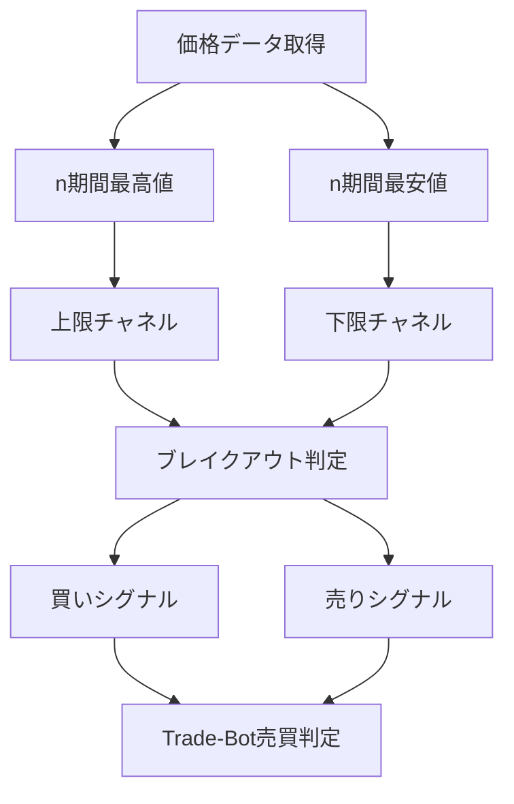

# Donchian Channel（ドンチャンチャネル）

## 概要

Donchian Channel（ドンチャンチャネル）は、

一定期間の

```text
最高値

最安値
```

を利用して、

現在の価格が

```text
過去の高値を突破したのか

過去の安値を突破したのか
```

を判断するためのテクニカル指標です。

1960年代に

:contentReference[oaicite:0]{index=0}

によって考案されました。

トレンドフォロー戦略の代表的な指標であり、

有名な

```text
タートルズ戦略
```

でも利用されています。

Donchian Channelは

```text
逆張り

ではなく

順張り
```

向きの指標です。

---

## Donchian Channelの考え方

非常にシンプルです。

```text
過去20日間の最高値

↓

突破

↓

買い
```

---

```text
過去20日間の最安値

↓

突破

↓

売り
```

---

という考え方です。

つまり

```text
高値更新

↓

上昇トレンド発生
```

を狙う指標です。

---

## この指標でわかること

### トレンド

Donchian Channelの最も重要な役割です。

```text
上限突破

↓

上昇トレンド発生
```

---

```text
下限突破

↓

下降トレンド発生
```

---

### 過熱感

判断できません。

RSIやCCIを利用します。

---

### ボラティリティ

チャネル幅から判断できます。

```text
幅が広い

↓

値動き大きい
```

---

```text
幅が狭い

↓

値動き小さい
```

---

### 投資家心理

高値更新

↓

買い参加者増加

↓

強気相場

---

安値更新

↓

売り参加者増加

↓

弱気相場

を表しています。

---

## 算出方法

### 計算式

上限チャネル

```text
n期間最高値
```

---

下限チャネル

```text
n期間最安値
```

---

中心線

```text
(上限 + 下限)

÷ 2
```

---

### 計算例

過去20日間

```text
最高値

120円
```

```text
最安値

80円
```

の場合

上限

```text
120円
```

---

下限

```text
80円
```

---

中心線

```text
(120 + 80)

÷ 2

= 100円
```

---

## 基本的な見方

### 上限突破

買いシグナル

---

### 下限突破

売りシグナル

---

### 上限沿いに推移

強い上昇トレンド

---

### 下限沿いに推移

強い下降トレンド

---

### チャネル幅拡大

ボラティリティ増加

---

## 初心者が最初に覚えるべきポイント

まずは以下だけ覚えれば十分です。

```text
20日高値突破

↓

買い候補
```

---

```text
20日安値突破

↓

売り候補
```

---

```text
上限沿い

↓

強い上昇トレンド
```

---

## チャートで見る代表的なシグナル

### 買いシグナル

価格が

```text
上限チャネル突破
```

した場合

買い候補

参照画像

```text
images/donchian-buy-signal.png
```

---

### 売りシグナル

価格が

```text
下限チャネル突破
```

した場合

売り候補

参照画像

```text
images/donchian-sell-signal.png
```

---

### トレンド継続

価格が

```text
上限付近
```

を維持

↓

上昇トレンド継続

---

価格が

```text
下限付近
```

を維持

↓

下降トレンド継続

参照画像

```text
images/donchian-trend-follow.png
```

---

### ダマシ

高値突破後

すぐにチャネル内へ戻るケース

参照画像

```text
images/donchian-fakeout.png
```

---

## 有効な相場

### 上昇相場

◎

最も得意

---

### 下降相場

◎

最も得意

---

### レンジ相場

△

ダマシが増加

---

### ブレイクアウト相場

◎

非常に有効

---

## 組み合わせると良い指標

### ADX

最重要

トレンド強度確認

---

### 出来高

ブレイクアウト信頼性確認

---

### RSI

過熱感確認

---

### MACD

トレンド転換確認

---

### ATR

損切り幅設定

---

## Trade-Bot実装観点

### 必要データ

- 高値
- 安値

---

### 算出頻度

- Tick
- 1分足
- 5分足
- 日足

---

### 実装難易度

★☆☆☆☆

最高値・最安値を取得するだけ

---

### シグナル化候補

#### 買いシグナル

```text
終値

>

20期間最高値
```

---

#### 売りシグナル

```text
終値

<

20期間最安値
```

---

#### 強い買いシグナル

```text
高値突破

かつ

ADX > 25

かつ

出来高増加
```

---

#### 強い売りシグナル

```text
安値突破

かつ

ADX > 25

かつ

出来高増加
```

---

## Mermaid図



---

## 注意点

初心者が最も勘違いしやすいのは

```text
高値突破

↓

必ず上昇する
```

ではないことです。

レンジ相場では

```text
高値突破

↓

即反落
```

というダマシが頻発します。

そのため

```text
ADX

出来高
```

を組み合わせることが重要です。

---

## まとめ

Donchian Channelは、

過去の

- 最高値
- 最安値

を利用して、

- ブレイクアウト
- トレンド発生
- トレンド継続

を判断する指標です。

Trade-Botでは、

順張り戦略の中心となる非常に実装しやすいインジケータです。

---

## 画像生成プロンプト

ファイル名

```text
images/donchian-channel-signals.png
```

プロンプト

```text
日本株の初心者向け教材。

白背景。

実際のローソク足チャート。

Donchian Channelを表示。

以下を日本語ラベル付きで表示。

・20期間最高値
・20期間最安値
・中心線
・買いシグナル（高値突破）
・売りシグナル（安値突破）
・上昇トレンド継続
・下降トレンド継続
・ブレイクアウト
・ダマシ

矢印と吹き出しで解説。

「過去20日高値突破」
「上昇トレンド発生」
「過去20日安値突破」
「下降トレンド発生」
「レンジ相場でのダマシ」
「出来高増加で信頼性向上」

初心者向け教材。
書籍掲載レベル。
高解像度。
日本語表記。
```
