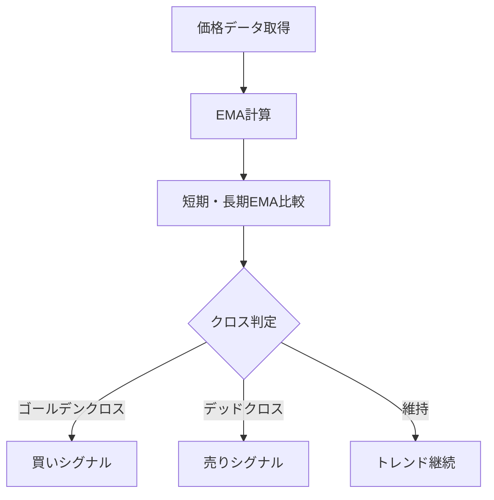

# 指数移動平均線（EMA）

## 概要
指数移動平均線（EMA）は、直近の価格をより重視して算出される移動平均線です。
単純移動平均（SMA）よりも価格変化への反応が速く、短期トレードやトレンド初動の検知に使われます。

---

## この指標でわかること
- トレンド
  → 価格がEMAの上か下かで方向性を判断できる

- 過熱感
  → 価格との乖離が大きいほど短期的な行き過ぎの可能性

- ボラティリティ
  → EMA自体の傾きの変化で市場の勢いを把握

- 投資家心理
  → 直近価格への反応度から「勢い重視の市場か」を判断

---

## 算出方法

### 計算式
EMAは以下の再帰式で計算されます。

EMA_t = P_t × α + EMA_{t-1} × (1 - α)
α = 2 / (n + 1)

- P_t：当日の価格
- n：期間（例：ローソク足の数。12日、26日など）

#### 補足：当日の価格（Pₜ）の意味

EMAにおける「当日の価格」とは、計算している時間足における最新の価格を指します。

- 日足EMA → 当日の終値（Close）
- 1時間足EMA → その時間足の終値
- 1分足EMA → 最新の価格（リアルタイム値）

つまりPₜは固定値ではなく、「時間足ごとの最新更新価格」です。

#### 補足2：EMAの特徴（重要）

EMAは過去の平均ではなく、以下の特徴を持ちます。

- 最新価格の影響を強く受ける
- 常に再帰的に更新される
- SMA（単純移動平均）より反応が速い

そのためトレードBotでは「遅延の少ないトレンド検知」に使われます。

---

### 計算例
例：期間 n=10 の場合

α = 2 / (10 + 1) = 0.1818
前日のEMA = 100
当日の価格 = 110

EMA = 110 × 0.1818 + 100 × 0.8182 = 101.82

→ 直近価格の影響が強く反映される

## 補足：短期EMAと長期EMAの違い

EMAは1本だけで使うのではなく、通常は複数の期間を組み合わせて使用します。

---

### 短期EMA
- 例：5, 9, 12, 20
- 特徴：
  - 価格変化に敏感
  - すぐ反応する
  - ノイズも多い

- 役割：
  → 直近の勢いを見る

---

### 長期EMA
- 例：50, 100, 200
- 特徴：
  - 変化が遅い
  - ノイズが少ない
  - トレンドを安定表示

- 役割：
  → 全体のトレンド方向を見る

---

## 短期 × 長期の関係

EMA戦略の本質はここ：

- 短期EMA → エントリー判断
- 長期EMA → トレンドフィルター

---

## クロス戦略（重要）

### ゴールデンクロス
短期EMA > 長期EMA

→ 上昇トレンド開始の可能性

---

### デッドクロス
短期EMA < 長期EMA

→ 下降トレンド開始の可能性

---

## 実務での典型構成

- 短期：12EMA
- 長期：26EMA
（MACDと同じ構成）

または

- 短期：20EMA
- 長期：50EMA

---

## Bot視点の本質

短期EMAと長期EMAの差を見る：

EMA差 = 短期EMA - 長期EMA

- プラス → 上昇優勢
- マイナス → 下降優勢
---

## 基本的な見方
- 価格 > EMA → 上昇トレンド
- 価格 < EMA → 下降トレンド

短期EMAと長期EMAのクロスで売買判断を行う。

---

## チャートで見る代表的なシグナル

### 買いシグナル
短期EMAが長期EMAを上抜け（ゴールデンクロス）。
→ 上昇トレンド開始の可能性

---

### 売りシグナル
短期EMAが長期EMAを下抜け（デッドクロス）。
→ 下降トレンド開始の可能性

---

### トレンド継続判定
価格がEMAの上（または下）に張り付きながら推移。
→ 強いトレンド継続

---

## 有効な相場
- 上昇相場：押し目買いが有効
- 下降相場：戻り売りが有効
- レンジ相場：ダマシが多く苦手

---

## 組み合わせると良い指標
- MACD
- RSI
- ボリンジャーバンド
- 出来高

---

## Trade-Bot実装観点

### 必要データ
- OHLC（終値）

### 算出頻度
- 1分足〜日足

### 実装難易度
- ★★☆☆☆（軽量・再帰計算）

### シグナル化候補
- ゴールデンクロス → 買い
- デッドクロス → 売り
- EMA上維持 → ホールド

---

## Mermaid図

