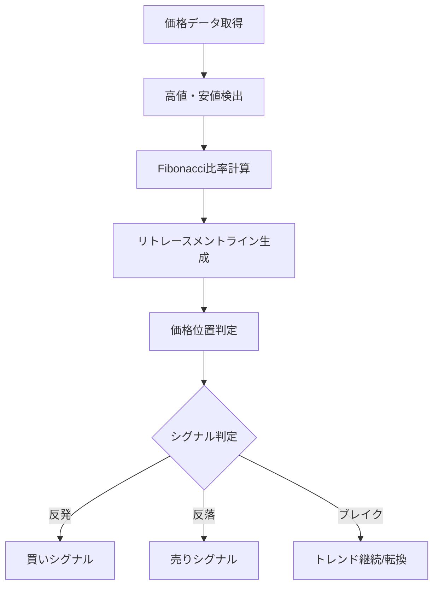

# Fibonacci Retracement（フィボナッチ・リトレースメント）

## 概要
Fibonacci Retracement（フィボナッチ・リトレースメント）は、相場の高値と安値の間にフィボナッチ比率（38.2%、50%、61.8%など）を適用し、価格の押し目・戻り目の目安を可視化するテクニカル指標です。
トレンド中の「どこで反発しやすいか」を推定するために使われます。

---

## この指標でわかること
- トレンド
  → 上昇・下降トレンドの中での調整局面を把握できる

- 過熱感
  → 深い押し（61.8%超え）はトレンド弱体化の可能性

- ボラティリティ
  → レンジ幅に対する調整の深さを確認できる

- 投資家心理
  → 「どの価格帯で反発期待が集中しているか」を可視化

---

## 算出方法

### 計算式
上昇トレンドの場合：

- 0% = 安値（起点）
- 100% = 高値（終点）

各リトレースメント水準：
- 23.6%
- 38.2%
- 50.0%（黄金比ではないが重要）
- 61.8%
- 78.6%

計算式：
水平ライン = 高値 - (高値 - 安値) × 比率

---

### 計算例
安値 = 100円
高値 = 200円

- 38.2%：200 - (100 × 0.382) = 161.8円
- 50%：200 - (100 × 0.5) = 150円
- 61.8%：200 - (100 × 0.618) = 138.2円

→ この価格帯が「押し目候補ゾーン」

---

## 基本的な見方
- 上昇トレンドでは「押し目買いポイント」
- 下降トレンドでは「戻り売りポイント」

特に38.2%〜61.8%は強い反発ゾーンとして機能しやすい。

---

## チャートで見る代表的なシグナル

### 買いシグナル
上昇トレンド中に38.2%〜61.8%で反発
→ 押し目買いポイント

---

### 売りシグナル
下降トレンド中に38.2%〜61.8%で反落
→ 戻り売りポイント

---

### トレンド継続判定
61.8%を維持して反発する場合
→ トレンド継続の可能性が高い

---

## 有効な相場
- 上昇トレンド：押し目買いが有効
- 下降トレンド：戻り売りが有効
- レンジ相場：機能しづらい（無効化されやすい）

---

## 組み合わせると良い指標
- 移動平均線（トレンド方向確認）
- RSI（反発タイミング補助）
- MACD（トレンド転換確認）
- ボリンジャーバンド（過熱感補強）

---

## Trade-Bot実装観点

### 必要データ
- 高値
- 安値
- トレンド判定用の価格系列

### 算出頻度
- スイング単位（数時間〜日足）

### 実装難易度
- ★★★☆☆（高値・安値のスイング判定が必要）

### シグナル化候補
- 38.2%反発 → 買い
- 61.8%反発 → 強い買い
- 61.8%割れ → トレンド崩壊シグナル

---

## Mermaid図

