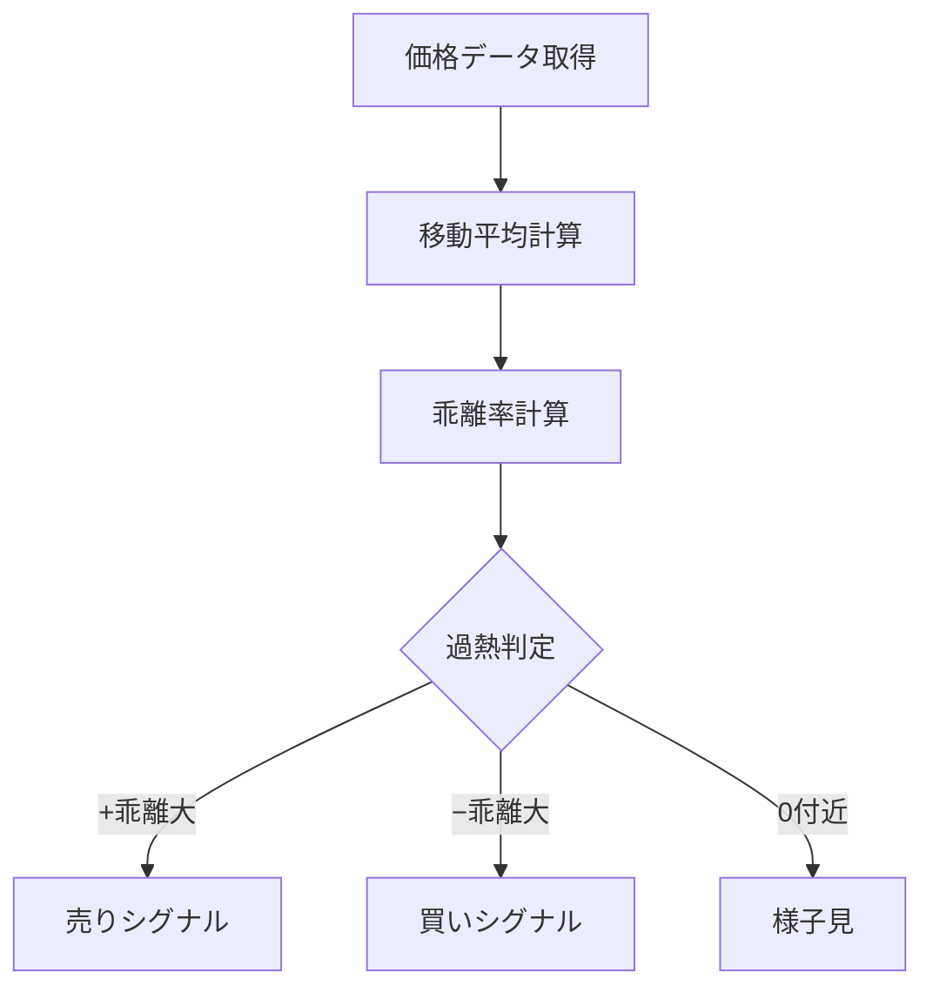

# 移動平均乖離率

## 概要
移動平均乖離率は、現在の価格が移動平均線からどれだけ離れているかを数値化した指標です。
過熱感（買われすぎ・売られすぎ）を判断するために使われます。

---

## この指標でわかること
- トレンド
  → 乖離がプラスなら上昇、マイナスなら下降

- 過熱感
  → 乖離が大きいほど行き過ぎの可能性

- ボラティリティ
  → 乖離幅の変化で変動の強さを把握

- 投資家心理
  → 平均からのズレで強気・弱気の偏りを判断

---

## 算出方法

### 計算式

移動平均乖離率 = (現在価格 - 移動平均) ÷ 移動平均 × 100

---

### 計算例

- 現在価格：110
- 移動平均（SMA or EMA）：100

乖離率 = (110 - 100) ÷ 100 × 100
= 10%

---

## 基本的な見方
- 0%付近 → 適正水準
- プラス → 買われすぎ傾向
- マイナス → 売られすぎ傾向

---

## チャートで見る代表的なシグナル

### 買われすぎ
乖離率が大きくプラス（例：+5%〜+15%）
→ 短期的な反落注意

---

### 売られすぎ
乖離率が大きくマイナス（例：-5%〜-15%）
→ 反発の可能性

---

### トレンド継続
プラス乖離が継続して拡大
→ 強い上昇トレンド

---

### ダマシ
一時的に乖離してすぐ0%へ戻る
→ レンジ相場で発生しやすい

---

## 有効な相場
- 上昇相場：押し目買い
- 下降相場：戻り売り
- レンジ相場：逆張り向き

---

## 組み合わせると良い指標
- RSI（過熱感補強）
- ボリンジャーバンド
- 出来高

---

## Trade-Bot実装観点

### 必要データ
- 現在価格
- 移動平均（SMA or EMA）

---

### 算出頻度
- 1分〜日足

---

### 実装難易度
- ★☆☆☆☆（非常に軽量）

---

### シグナル化候補
- +5%以上 → 売り候補
- -5%以下 → 買い候補

---

## Mermaid図

