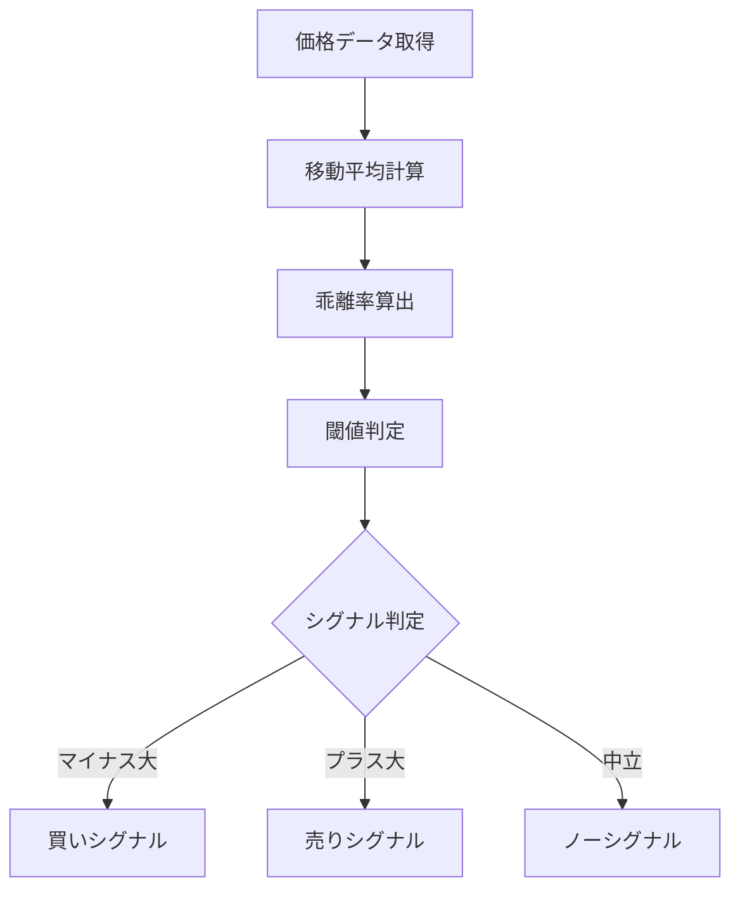

# 移動平均乖離率

## 概要
移動平均乖離率は、現在の価格が移動平均線からどれだけ離れているかを％で示す指標です。
価格の「行き過ぎ（過熱感）」を定量的に把握できるため、逆張り判断に使われます。

---

## この指標でわかること
- トレンド
  → 移動平均より上か下かで方向性を判断できる

- 過熱感
  → 乖離率が大きいほど買われすぎ・売られすぎの可能性

- ボラティリティ
  → 乖離の拡大・縮小で値動きの激しさを把握

- 投資家心理
  → 「平均回帰したい力」がどれくらい強いかを数値化

---

## 算出方法

### 計算式
乖離率（%） = (現在価格 - 移動平均) / 移動平均 × 100

---

### 計算例
- 現在価格：1,100円
- 移動平均：1,000円

乖離率 = (1,100 - 1,000) / 1,000 × 100 = +10%

→ +10%は「買われすぎ傾向」

逆に

- 現在価格：900円
- 移動平均：1,000円

乖離率 = -10%

→ 「売られすぎ傾向」

---

## 基本的な見方
- プラス乖離 → 買われすぎ傾向
- マイナス乖離 → 売られすぎ傾向

一般的に：
- ±5%：軽い乖離
- ±10%：過熱ゾーン
- ±15%以上：強い逆張り警戒ゾーン

---

## チャートで見る代表的なシグナル

### 買いシグナル
大きくマイナス乖離（-10%以下など）
→ 売られすぎからの反発狙い

---

### 売りシグナル
大きくプラス乖離（+10%以上など）
→ 買われすぎからの反落狙い

---

### トレンド継続判定
高乖離のまま推移
→ 強いトレンド発生中（逆張り危険）

---

## 有効な相場
- 逆張り相場：非常に有効
- レンジ相場：特に有効
- トレンド相場：危険（踏み上げ・踏み下げリスク）

---

## 組み合わせると良い指標
- RSI（過熱感の確認）
- ボリンジャーバンド（統計的乖離確認）
- MACD（トレンド判定補助）

---

## Trade-Bot実装観点

### 必要データ
- 終値
- 移動平均（SMA or EMA）

### 算出頻度
- リアルタイム〜日足

### 実装難易度
- ★☆☆☆☆（非常に簡単）

### シグナル化候補
- -10%以下 → 買い
- +10%以上 → 売り
- 0%付近回帰 → 利確ポイント

---

## Mermaid図

