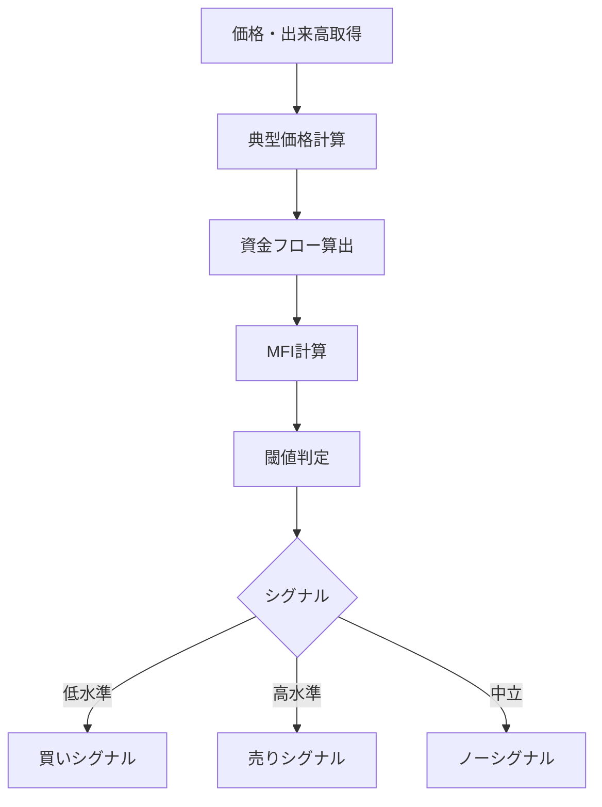

# MFI（Money Flow Index）

## 概要
MFI（Money Flow Index）は、価格と出来高を組み合わせて資金の流入・流出を数値化するオシレーター系指標です。
RSIに出来高要素を加えたような指標で、買われすぎ・売られすぎだけでなく「資金の強さ」も判断できます。

---

## この指標でわかること
- トレンド
  → 資金流入が続いているかでトレンドの強さを判断できる

- 過熱感
  → MFIが高いほど買われすぎ、低いほど売られすぎ

- ボラティリティ
  → 資金の急増・急減で相場の不安定さを把握

- 投資家心理
  → 出来高を伴った買い・売りの強弱を可視化

---

## 算出方法

### 計算式
MFIは以下の手順で計算されます。

1. 典型価格（Typical Price）
TP = (高値 + 安値 + 終値) / 3

2. 資金フロー（Money Flow）
MF = TP × 出来高

3. 価格変化に基づき
- 正の資金フロー
- 負の資金フロー

4. MFI計算
MFI = 100 - (100 / (1 + 正のMF / 負のMF))

---

### 計算例
例：
- TP上昇日：MF = 1,000,000
- TP下降日：MF = 500,000
MFI = 100 - (100 / (1 + 1,000,000 / 500,000))
= 100 - (100 / (1 + 2))
= 100 - 33.33
= 66.67

→ 66.7はやや買われ気味

---

## 基本的な見方
- 80以上 → 買われすぎ
- 20以下 → 売られすぎ
- 50付近 → 中立

RSIと似ているが「出来高込み」な点が重要。

---

## チャートで見る代表的なシグナル

### 買いシグナル
MFIが20以下から上昇
→ 資金流入開始＝反発の可能性

---

### 売りシグナル
MFIが80以上から下降
→ 資金流出開始＝反落の可能性

---

### トレンド継続判定
MFIが50以上で安定
→ 資金流入が継続し上昇トレンド維持

---

## 有効な相場
- トレンド相場：強い資金流入判断に有効
- レンジ相場：逆張りに有効
- 出来高急増相場：特に有効

---

## 組み合わせると良い指標
- 出来高（必須級）
- RSI（過熱感補助）
- MACD（トレンド補助）
- ボリンジャーバンド（統計補助）

---

## Trade-Bot実装観点

### 必要データ
- 高値
- 安値
- 終値
- 出来高

### 算出頻度
- 1分足〜日足

### 実装難易度
- ★★★☆☆（出来高処理が必要）

### シグナル化候補
- MFI < 20 → 買い
- MFI > 80 → 売り
- 50ライン突破 → トレンド判定

---

## Mermaid図

