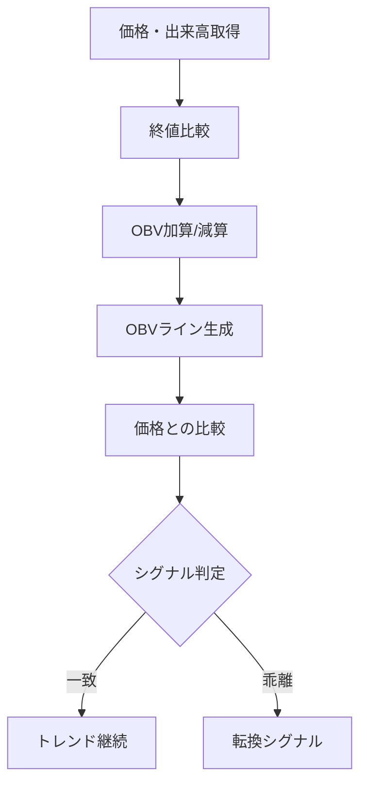

# OBV（On-Balance Volume）

## 概要
OBV（On-Balance Volume）は、出来高の累積変化によって資金の流入・流出を可視化するテクニカル指標です。
価格よりも先に動くことがあるため「先行指標」として使われます。

---

## この指標でわかること
- トレンド
  → OBVの上昇・下降で資金の流れ方向を判断できる

- 過熱感
  → 価格とOBVの乖離で買われすぎ・売られすぎを推測

- ボラティリティ
  → OBVの傾き変化で資金移動の激しさを把握

- 投資家心理
  → 出来高ベースの強気・弱気の蓄積を可視化

---

## 算出方法

### 計算式
OBVは以下のルールで累積計算されます。

- 当日終値 > 前日終値
  → OBV = 前日OBV + 当日出来高

- 当日終値 < 前日終値
  → OBV = 前日OBV - 当日出来高

- 当日終値 = 前日終値
  → OBV変化なし

---

### 計算例

初期OBV = 1,000

| 日 | 終値 | 出来高 | OBV |
|----|------|--------|-----|
| 1  | 100  | 500    | 1,000 |
| 2  | 105  | 300    | 1,300 |
| 3  | 102  | 400    | 900  |
| 4  | 108  | 600    | 1,500 |

→ 価格よりも資金の流れを重視した動きになる

---

## 基本的な見方
- OBV上昇 → 買い圧力が強い
- OBV下降 → 売り圧力が強い
- 価格とOBVが同方向 → トレンド継続
- 価格とOBVが逆方向 → ダイバージェンス（転換サイン）

---

## チャートで見る代表的なシグナル

### 買いシグナル
- 価格横ばい or 微増
- OBVが上昇

→ 先行して買い圧力が増加

---

### 売りシグナル
- 価格横ばい or 微減
- OBVが下降

→ 先行して売り圧力が増加

---

### トレンド継続判定
- 価格とOBVが同方向に推移

→ 強いトレンド継続

---

## 有効な相場
- トレンド相場：非常に有効
- ブレイク相場：資金流入検知に有効
- レンジ相場：ダマシあり

---

## 組み合わせると良い指標
- 移動平均線（トレンド確認）
- MACD（モメンタム確認）
- RSI（過熱感補助）
- ボリンジャーバンド（ボラティリティ補助）

---

## Trade-Bot実装観点

### 必要データ
- 終値
- 出来高

### 算出頻度
- 1分足〜日足

### 実装難易度
- ★★☆☆☆（単純累積計算）

### シグナル化候補
- OBV上昇＋価格上昇 → 買い継続
- OBV下降＋価格上昇 → 天井警戒
- OBV上昇＋価格下落 → 底打ち候補

---

## Mermaid図

