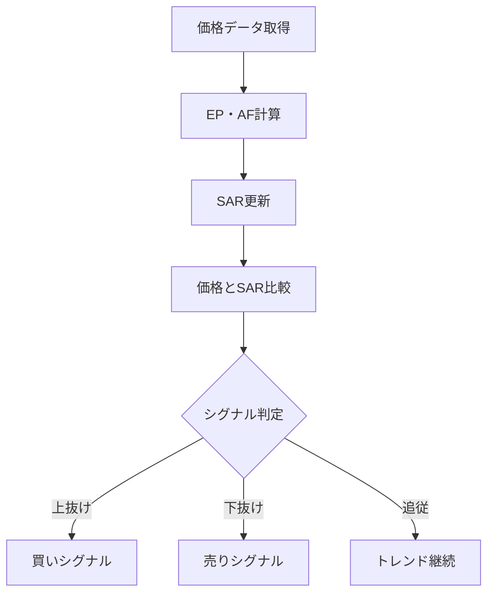

# パラボリックSAR（Parabolic SAR）

## 概要
パラボリックSAR（Stop And Reverse）は、トレンドの方向と転換点を視覚的に示すテクニカル指標です。
価格の上下にドット（点）を表示し、トレンド転換のタイミングを判断します。

---

## この指標でわかること
- トレンド
  → SARの位置（価格の上か下か）で方向性を判断

- 過熱感
  → SARが価格に近づくほどトレンド終了が近い可能性

- ボラティリティ
  → SARの加速で値動きの強さを把握

- 投資家心理
  → トレンド継続か反転かの境界を可視化

---

## 算出方法

### 計算式

上昇トレンド：
SAR(t+1) = SAR(t) + AF × (EP - SAR(t))

下降トレンド：
SAR(t+1) = SAR(t) - AF × (SAR(t) - EP)

---

### パラメータ
- AF（Acceleration Factor）：0.02 から開始し最大0.2まで増加
- EP（Extreme Point）：トレンド中の最高値（上昇）または最安値（下降）

---

### 計算ロジック
- 上昇トレンド時：SARは価格の下側に配置
- 下降トレンド時：SARは価格の上側に配置
- 価格がSARを抜けるとトレンド反転（リバーサル）

---

### 計算例

初期値：
- SAR = 100
- EP = 120
- AF = 0.02

計算：

SAR = 100 + 0.02 × (120 - 100)
SAR = 100 + 0.02 × 20
SAR = 100 + 0.4
SAR = 100.4

→ SARは徐々に価格へ追従し、転換点で反転する

---

## 基本的な見方
- SARが価格の下 → 上昇トレンド
- SARが価格の上 → 下降トレンド
- SARが価格をクロス → トレンド転換

---

## チャートで見る代表的なシグナル

### 買いシグナル
価格がSARを下から上にブレイク
→ 下降トレンド終了・上昇転換

---

### 売りシグナル
価格がSARを上から下にブレイク
→ 上昇トレンド終了・下降転換

---

### トレンド継続判定
SARが価格に追従し続ける状態
→ トレンド継続中

---

## 有効な相場
- トレンド相場：非常に有効
- レンジ相場：ダマシが多い
- 急変動相場：遅延しやすい

---

## 組み合わせると良い指標
- ADX（トレンド強度）
- MACD（方向確認）
- 移動平均線（大局判断）
- 出来高（ブレイク確認）

---

## Trade-Bot実装観点

### 必要データ
- 高値
- 安値
- 終値
- トレンド状態保持

### 算出頻度
- 1分足〜日足

### 実装難易度
- ★★★★☆（状態依存＋再帰計算）

### シグナル化候補
- SARブレイク上昇 → 買い
- SARブレイク下降 → 売り
- SAR追従 → ホールド

---

## Mermaid図

