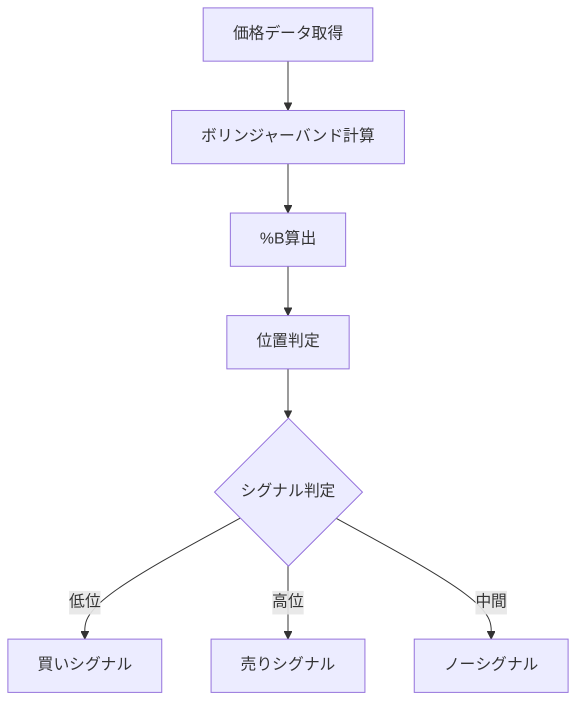

# %B（Percent B）

## 概要
%B（Percent B）は、ボリンジャーバンドの中で現在価格がどの位置にあるかを0〜1の範囲で数値化した指標です。
価格が上限バンド・下限バンドのどこにいるかを直感的に判断できます。

---

## この指標でわかること
- トレンド
  → 0〜1の位置変化でバンド内の推移方向を把握

- 過熱感
  → 1に近いほど買われすぎ、0に近いほど売られすぎ

- ボラティリティ
  → バンド幅と組み合わせて変動の強さを判断

- 投資家心理
  → 「どの価格帯が意識されているか」を可視化

---

## 算出方法

### 計算式
%Bは以下の式で計算されます。

%B = (現在価格 - 下限バンド) / (上限バンド - 下限バンド)

---

### 計算の意味
- 下限バンド → 0
- 中心線 → 0.5付近
- 上限バンド → 1

つまり、価格がバンド内のどこにいるかを正規化した指標です。

---

### 計算例

条件：
- 上限バンド = 110
- 中心線 = 100
- 下限バンド = 90
- 現在価格 = 105

計算：

%B = (現在価格 - 下限バンド) / (上限バンド - 下限バンド)

%B = (105 - 90) / (110 - 90)
%B = 15 / 20
%B = 0.75

---

### 結果の解釈
%B = 0.75

→ 上限バンドに近い位置
→ やや買われすぎ状態

---

## 基本的な見方
- %B = 1.0 → 上限バンド到達（強い買われすぎ）
- %B = 0.5 → 中央（移動平均付近）
- %B = 0.0 → 下限バンド到達（強い売られすぎ）

---

## チャートで見る代表的なシグナル

### 買いシグナル
%Bが0付近から上昇
→ 下限バンド反発（押し目買い）

---

### 売りシグナル
%Bが1付近から下降
→ 上限バンド反落（戻り売り）

---

### トレンド継続判定
%Bが0.5以上または以下で張り付き
→ トレンド継続状態

---

## 有効な相場
- レンジ相場：非常に有効
- トレンド相場：ダマシあり
- 低ボラ相場：特に有効

---

## 組み合わせると良い指標
- ボリンジャーバンド（必須）
- RSI（過熱感補助）
- MACD（トレンド確認）

---

## Trade-Bot実装観点

### 必要データ
- 上限バンド
- 下限バンド
- 現在価格

### 算出頻度
- リアルタイム〜日足

### 実装難易度
- ★☆☆☆☆（非常に簡単）

### シグナル化候補
- %B < 0.2 → 買い
- %B > 0.8 → 売り
- %B 0.5突破 → トレンド判定

---

## Mermaid図

