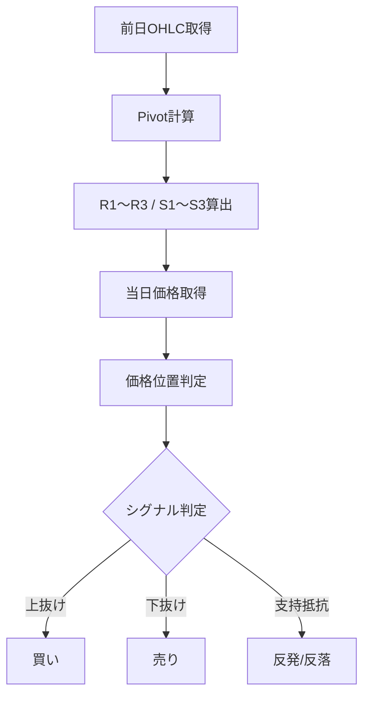

# Pivot Point（ピボットポイント）

## 概要
Pivot Point（ピボットポイント）は、前日の高値・安値・終値から当日の支持線・抵抗線を算出するテクニカル指標です。
デイトレードで「その日の基準価格と節目」を把握するために使われます。

---

## この指標でわかること
- トレンド
  → 価格がPivotより上か下かで方向性を判断

- 過熱感
  → R1〜R3 / S1〜S3到達で行き過ぎ判断

- ボラティリティ
  → R3〜S3の幅で値動きの広さを把握

- 投資家心理
  → 多くのトレーダーが意識する水平ライン

---

## 算出方法

### 基本（Pivot Point）
P = (高値 + 安値 + 終値) / 3

---

### サポート・レジスタンス

R1 = (2 × P) - 安値
S1 = (2 × P) - 高値

R2 = P + (高値 - 安値)
S2 = P - (高値 - 安値)

R3 = 高値 + 2 × (P - 安値)
S3 = 安値 - 2 × (高値 - P)

---

## 計算例

前日データ：
高値 = 110
安値 = 90
終値 = 100

---

### ① Pivot Point
P = (110 + 90 + 100) / 3
P = 300 / 3
P = 100

---

### ② R1 / S1
R1 = (2 × 100) - 90 = 110
S1 = (2 × 100) - 110 = 90

---

### ③ R2 / S2
R2 = 100 + (110 - 90) = 120
S2 = 100 - (110 - 90) = 80

---

### ④ R3 / S3
R3 = 110 + 2 × (100 - 90) = 130
S3 = 90 - 2 × (110 - 100) = 70

---

## 基本的な見方
- 価格 > P → 上昇優勢
- 価格 < P → 下降優勢
- R1〜R3 → 利確・反発ゾーン
- S1〜S3 → 押し目・反発ゾーン

---

## チャートで見る代表的なシグナル

### 買いシグナル
- S1〜S2で反発
- Pを上抜け

→ 上昇転換・押し目買い

---

### 売りシグナル
- R1〜R2で反落
- Pを下抜け

→ 戻り売り・下降転換

---

### トレンド継続判定
- Pより上で推移 → 上昇継続
- Pより下で推移 → 下降継続

---

## 有効な相場
- デイトレ：非常に有効
- レンジ相場：支持抵抗として有効
- ブレイク相場：トレンド発生判断に有効

---

## 組み合わせると良い指標
- VWAP（当日平均価格）
- RSI（過熱感）
- MACD（方向性）
- 出来高（ブレイク確認）

---

## Trade-Bot実装観点

### 必要データ
- 前日高値
- 前日安値
- 前日終値

### 算出頻度
- 1日1回（寄り付き前）

### 実装難易度
- ★★☆☆☆（固定計算で軽量）

### シグナル化候補
- P上抜け → 買い
- P下抜け → 売り
- R1到達 → 利確候補
- S1到達 → 押し目候補

---

## Mermaid図

