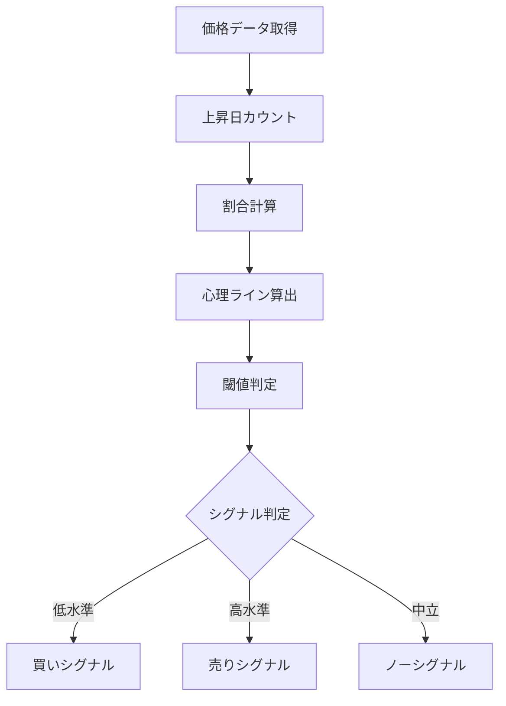

# サイコロジカルライン（Psychological Line）

## 概要
サイコロジカルラインは、一定期間において「上昇した日数の割合」をもとに投資家心理（強気・弱気）を数値化するオシレーター系指標です。
市場の楽観・悲観の偏りをシンプルに把握できます。

---

## この指標でわかること
- トレンド
  → 上昇日と下落日の偏りで方向性を判断

- 過熱感
  → 上昇日が極端に多いと買われすぎ

- ボラティリティ
  → 上昇・下落の偏りで不安定さを把握

- 投資家心理
  → 市場が「強気か弱気か」を直感的に可視化

---

## 算出方法

### 計算式
サイコロジカルラインは以下で計算されます。

サイコロジカルライン = (上昇した日数 ÷ 期間日数) × 100

---

### 計算の意味
- 100% → すべて上昇
- 50% → 上昇と下落が同数
- 0% → すべて下落

---

### 計算例

期間：10日間

上昇日数：7日
下落日数：3日

計算：

サイコロジカルライン = (7 ÷ 10) × 100
サイコロジカルライン = 70%

---

### 結果の解釈
- 70% → 強気優勢
- 50% → 中立
- 30% → 弱気優勢

---

## 基本的な見方
- 75%以上 → 買われすぎ警戒
- 25%以下 → 売られすぎ警戒
- 50%付近 → 中立・方向感なし

---

## チャートで見る代表的なシグナル

### 買いシグナル
- 25%以下から上昇
→ 売られすぎからの反発

---

### 売りシグナル
- 75%以上から下降
→ 買われすぎからの反落

---

### トレンド継続判定
- 50%以上で推移
→ 強気相場継続
- 50%以下で推移
→ 弱気相場継続

---

## 有効な相場
- レンジ相場：非常に有効
- トレンド相場：補助的に有効
- 低ボラ相場：特に有効

---

## 組み合わせると良い指標
- RSI（過熱感補強）
- MACD（トレンド確認）
- 移動平均線（方向性確認）

---

## Trade-Bot実装観点

### 必要データ
- 終値（過去n期間）

### 算出頻度
- 1日1回（スイング向け）

### 実装難易度
- ★☆☆☆☆（非常に簡単）

### シグナル化候補
- 25%以下 → 買い
- 75%以上 → 売り
- 50%付近 → ホールド

---

## Mermaid図

