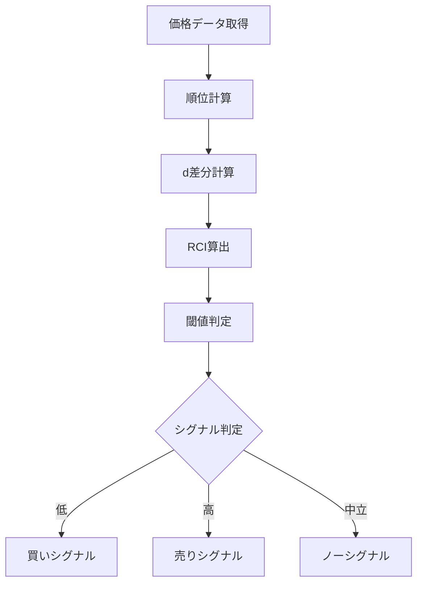

# RCI（Rank Correlation Index）

## 概要
RCI（順位相関指数）は、価格の「時間順位」と「価格順位」のズレを数値化し、買われすぎ・売られすぎを判断するオシレーター系指標です。
価格の勢いではなく「順序の歪み」を見るのが特徴です。

---

## この指標でわかること
- トレンド
  → RCIの方向で短期トレンドを判断

- 過熱感
  → +80以上 / -80以下で極端な状態を判断

- ボラティリティ
  → RCIの急変で短期変動の強さを把握

- 投資家心理
  → 「上がりすぎ・下がりすぎの順序崩れ」を数値化

---

## 算出方法

### 計算式
RCIは以下で計算されます。

RCI = (1 - (6 × Σd²) / (n × (n² - 1))) × 100

---

### 計算要素
- n：期間（日数など）
- d：価格順位と時間順位の差
- Σd²：順位差の二乗和

---

### 計算の意味
- +100 → 完全上昇トレンド（順位一致）
- 0 → ランダム状態
- -100 → 完全下降トレンド

---

### 計算例

期間：5日

価格順位と時間順位の差 d：

| 日 | 順位差 d | d² |
|----|----------|----|
| 1  | 2        | 4  |
| 2  | 1        | 1  |
| 3  | 0        | 0  |
| 4  | -1       | 1  |
| 5  | -2       | 4  |

Σd² = 10

---

### RCI計算

RCI = (1 - (6 × 10) / (5 × (25 - 1))) × 100
RCI = (1 - 60 / 120) × 100
RCI = (1 - 0.5) × 100
RCI = 50

---

### 結果の解釈
- +80以上 → 買われすぎ
- -80以下 → 売られすぎ
- 0付近 → 中立

---

## 基本的な見方
- +80以上 → 天井圏
- -80以下 → 底値圏
- 0ライン → トレンド転換の目安

---

## チャートで見る代表的なシグナル

### 買いシグナル
- -80以下から上昇
→ 売られすぎ反発

---

### 売りシグナル
- +80以上から下降
→ 買われすぎ反落

---

### トレンド継続判定
- +50以上維持 → 上昇トレンド
- -50以下維持 → 下降トレンド

---

## 有効な相場
- レンジ相場：非常に有効
- トレンド初期：補助的に有効
- 高ボラ相場：ダマシ増加

---

## 組み合わせると良い指標
- 移動平均線（方向性）
- RSI（過熱感）
- MACD（トレンド確認）

---

## Trade-Bot実装観点

### 必要データ
- 終値
- 過去n期間の価格データ

### 算出頻度
- 1日〜短期足

### 実装難易度
- ★★★☆☆（順位計算が必要）

### シグナル化候補
- RCI < -80 → 買い
- RCI > +80 → 売り
- 0クロス → トレンド転換

---

## Mermaid図

