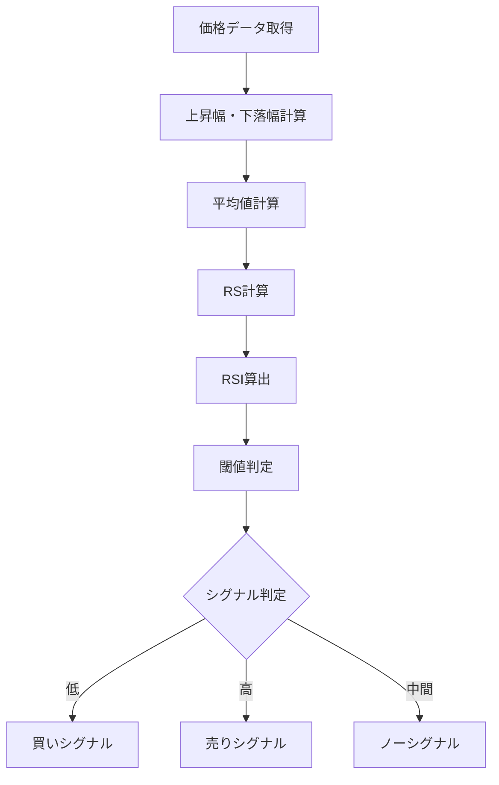

# RSI（Relative Strength Index）

## 概要
RSI（相対力指数）は、一定期間における価格の上昇幅と下落幅の比率から、買われすぎ・売られすぎを数値化するオシレーター系指標です。
0〜100の範囲で表され、相場の過熱感を直感的に判断できます。

---

## この指標でわかること
- トレンド
  → RSIの推移方向で短期トレンドを把握

- 過熱感
  → 70以上で買われすぎ、30以下で売られすぎ

- ボラティリティ
  → RSIの振れ幅で相場の不安定さを把握

- 投資家心理
  → 強気・弱気のバランスを数値化

---

## 算出方法

### 計算式
RSIは以下の式で計算されます。

RSI = 100 - (100 / (1 + RS))

RS = 平均上昇幅 ÷ 平均下落幅

---

### 計算ステップ

① 価格変化を計算
- 前日比の上昇幅
- 前日比の下落幅

---

② 平均を計算（n期間）
- 平均上昇幅 = 上昇日の平均値
- 平均下落幅 = 下落日の平均値

---

③ RSを計算
RS = 平均上昇幅 / 平均下落幅

---

④ RSIを計算
RSI = 100 - (100 / (1 + RS))

---

### 計算例

期間：14日

- 平均上昇幅 = 1.5
- 平均下落幅 = 0.5

---

RS = 1.5 / 0.5 = 3

RSI = 100 - (100 / (1 + 3))
RSI = 100 - (100 / 4)
RSI = 100 - 25
RSI = 75

---

### 結果の解釈
- RSI = 75 → 買われすぎ
- RSI = 50 → 中立
- RSI = 25 → 売られすぎ

---

## 基本的な見方
- 70以上 → 買われすぎ警戒
- 30以下 → 売られすぎ警戒
- 50付近 → 中立

---

## チャートで見る代表的なシグナル

### 買いシグナル
- RSIが30以下から上昇
→ 売られすぎからの反発

---

### 売りシグナル
- RSIが70以上から下降
→ 買われすぎからの反落

---

### トレンド継続判定
- RSIが50以上で安定
→ 上昇トレンド継続
- RSIが50以下で安定
→ 下降トレンド継続

---

## 有効な相場
- レンジ相場：非常に有効
- トレンド相場：ダマシあり
- 低ボラ相場：特に有効

---

## 組み合わせると良い指標
- ボリンジャーバンド（過熱感補強）
- MACD（トレンド確認）
- 出来高（強弱確認）

---

## Trade-Bot実装観点

### 必要データ
- 終値
- n期間の価格変化

### 算出頻度
- 1分足〜日足

### 実装難易度
- ★★☆☆☆（平均計算が必要）

### シグナル化候補
- RSI < 30 → 買い
- RSI > 70 → 売り
- 50ライン突破 → トレンド判定

---

## Mermaid図

