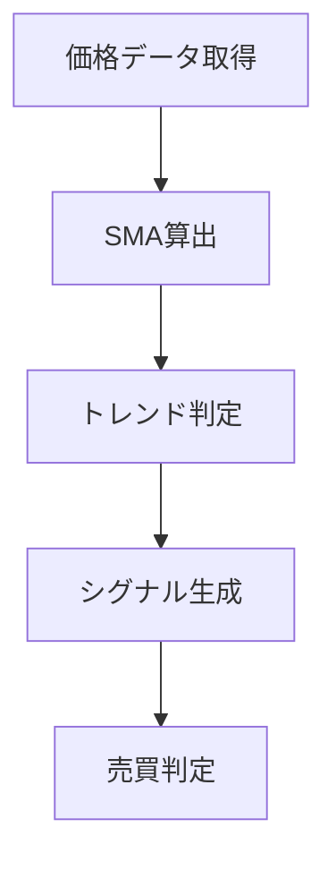

# 移動平均線（SMA）

## 概要

移動平均線（SMA: Simple Moving Average）は、一定期間の終値の平均値を線で表したテクニカル指標です。

株価は日々上下に変動しますが、移動平均線を表示することで細かな値動きがならされ、現在のトレンド（上昇・下降・横ばい）を把握しやすくなります。

最も利用者が多いテクニカル指標の一つであり、多くの投資家が売買判断の基準として利用しています。

Trade-Botにおいても基本となるテクニカル指標です。

---

## この指標でわかること

### トレンド

移動平均線の向きから現在のトレンドを判断できます。

* 上向き → 上昇トレンド
* 下向き → 下降トレンド
* 横向き → レンジ相場

### 過熱感

価格が移動平均線から大きく離れる場合、

* 買われすぎ
* 売られすぎ

の可能性があります。

ただし、移動平均線単体では過熱感の判断精度は高くありません。

### ボラティリティ

直接的には判断できません。

ボラティリティ分析にはATRやボリンジャーバンドとの併用が推奨されます。

### 投資家心理

多くの投資家が見ているため、

* 25日移動平均線
* 75日移動平均線
* 200日移動平均線

付近では買いや売りが集中しやすくなります。

その結果、支持線（サポートライン）や抵抗線（レジスタンスライン）として機能する場合があります。

---

## 算出方法

### 計算式

5日移動平均線の場合

SMA = （過去5日間の終値合計）÷ 5

### 計算例

過去5日間の終値

1000円

1020円

1010円

1030円

1040円

の場合

SMA = (1000 + 1020 + 1010 + 1030 + 1040) ÷ 5

SMA = 1020円

---

## 基本的な見方

### 株価が移動平均線より上

買い優勢

### 株価が移動平均線より下

売り優勢

### 移動平均線が上向き

上昇トレンド

### 移動平均線が下向き

下降トレンド

---

## チャートで見る代表的なシグナル

### ゴールデンクロス（買いシグナル）

短期移動平均線が長期移動平均線を上抜ける状態です。

例

* 5日線が25日線を上抜ける

多くの投資家が買いシグナルとして認識します。

参照画像

images/sma-golden-cross.png

---

### デッドクロス（売りシグナル）

短期移動平均線が長期移動平均線を下抜ける状態です。

多くの投資家が売りシグナルとして認識します。

参照画像

images/sma-dead-cross.png

---

### トレンド継続

価格が移動平均線の上で推移し続ける状態です。

強い上昇トレンドでよく見られます。

参照画像

images/sma-trend-follow.png

---

### ダマシ

ゴールデンクロス発生後にすぐ下落するケースです。

移動平均線のみで売買すると損失につながる場合があります。

参照画像

images/sma-fakeout.png

---

## 有効な相場

### 上昇相場

非常に有効です。

### 下降相場

非常に有効です。

### レンジ相場

ダマシが増えるため注意が必要です。

---

## 組み合わせると良い指標

### RSI

買われすぎ・売られすぎを確認できます。

### MACD

トレンド転換の確認ができます。

### 出来高

シグナルの信頼性を確認できます。

---

## Trade-Bot実装観点

### 必要データ

* 終値

### 算出頻度

* Tick
* 1分足
* 5分足
* 日足

### 実装難易度

★☆☆☆☆

### シグナル化候補

* ゴールデンクロス
* デッドクロス
* SMA上抜け
* SMA下抜け
* SMA乖離率

---

## Mermaid図

---

## 注意点

* ゴールデンクロスだけで買わない
* レンジ相場ではダマシが多い
* 移動平均線は未来予測ではなく過去データの平均である

---

## まとめ

移動平均線は最も基本的なテクニカル指標です。

まずは

* トレンド把握
* ゴールデンクロス
* デッドクロス

を理解することから始めましょう。

Trade-Botでも最優先で実装したい指標の一つです。

---

## 画像生成プロンプト

ファイル名

images/sma-signals.png

プロンプト

「日本株の実践チャート教材。白背景。ローソク足チャート。5日移動平均線と25日移動平均線を表示。ゴールデンクロス、デッドクロス、上昇トレンド、下降トレンド、ダマシを日本語ラベルと矢印付きで解説。初心者向け教材として利用できる高解像度チャート。」
