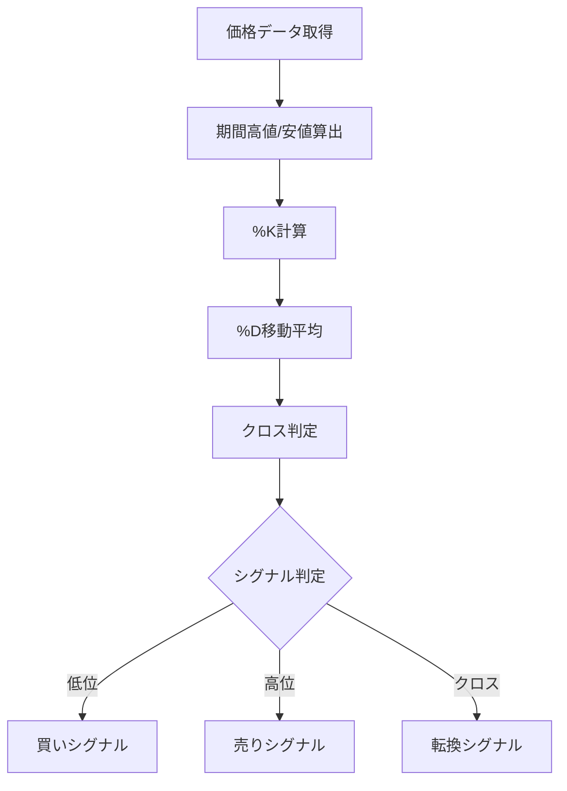

# ストキャスティクス（Stochastics）

## 概要
ストキャスティクスは、一定期間の価格レンジに対して「現在価格がどの位置にあるか」を0〜100で数値化するオシレーター系指標です。
相場の反転ポイント（天井・底）を捉えるのに適しています。

---

## この指標でわかること
- トレンド
  → %K・%Dの方向で短期トレンドを把握

- 過熱感
  → 80以上で買われすぎ、20以下で売られすぎ

- ボラティリティ
  → 値動きのレンジ内での位置変化で変動を把握

- 投資家心理
  → 価格がレンジ上限・下限どちらに偏っているか

---

## 算出方法

### 計算式

%K = (現在値 - 最安値) / (最高値 - 最安値) × 100

%D = %Kの移動平均

---

### 計算ステップ

① 一定期間（例：14日）の
- 最高値
- 最安値
を取得

---

② %Kを計算
%K = (現在値 - 最安値) / (最高値 - 最安値) × 100

---

③ %Dを計算
%D = %Kの3日移動平均

---

### 計算例

期間：
- 最高値 = 120
- 最安値 = 100
- 現在値 = 110

---

%K = (110 - 100) / (120 - 100) × 100
%K = 10 / 20 × 100
%K = 50

---

%D（仮に）
%D = 48

---

### 結果の解釈
- 80以上 → 買われすぎ
- 20以下 → 売られすぎ
- 50付近 → 中立

---

## 基本的な見方
- %K > %D → 上昇圧力
- %K < %D → 下降圧力
- 80以上 → 天井圏
- 20以下 → 底値圏

---

## チャートで見る代表的なシグナル

### 買いシグナル
- 20以下から%Kが%Dを上抜け
→ 売られすぎ反発

---

### 売りシグナル
- 80以上から%Kが%Dを下抜け
→ 買われすぎ反落

---

### トレンド継続判定
- 50付近で推移
→ レンジ継続
- 80以上 or 20以下に張り付き
→ 強トレンド

---

## 有効な相場
- レンジ相場：非常に有効
- トレンド相場：ダマシ多い
- 低ボラ相場：特に有効

---

## 組み合わせると良い指標
- RSI（過熱感補強）
- MACD（トレンド確認）
- ボリンジャーバンド（位置確認）

---

## Trade-Bot実装観点

### 必要データ
- 高値
- 安値
- 終値

### 算出頻度
- 1分足〜日足

### 実装難易度
- ★★☆☆☆（レンジ計算）

### シグナル化候補
- %K < 20 → 買い
- %K > 80 → 売り
- %Kと%Dクロス → 売買判断

---

## Mermaid図

