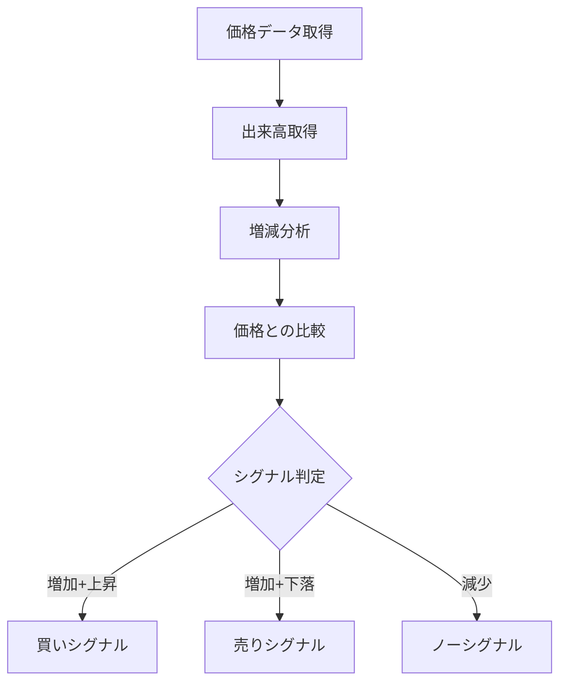

# 出来高（Volume）

## 概要
出来高は、一定期間における売買成立数量を示す最も基本的な市場データであり、「市場参加者の多さ」と「取引の強さ」を表します。
価格変動の信頼性を判断するための重要な補助指標です。

---

## この指標でわかること
- トレンド
  → 価格上昇＋出来高増加で強いトレンド

- 過熱感
  → 出来高急増は天井・底の可能性

- ボラティリティ
  → 出来高増加で値動きが激しくなる傾向

- 投資家心理
  → 参加者の増減＝市場の関心度

---

## 算出方法

### 計算式
出来高は基本的に「合計取引数量」です。

Volume = Σ（成立した取引数量）

---

### 計算の意味
- 出来高増加 → 市場参加者増加
- 出来高減少 → 関心低下・様子見
- 急増 → ブレイクやパニックの可能性

---

### 計算例

ある期間の出来高：

| 日 | 出来高 |
|----|--------|
| 1  | 1000   |
| 2  | 1500   |
| 3  | 2000   |

合計出来高：

Volume = 1000 + 1500 + 2000
Volume = 4500

---

## 基本的な見方
- 価格上昇＋出来高増加 → 本物の上昇
- 価格上昇＋出来高減少 → 弱い上昇
- 価格下落＋出来高増加 → 強い下落
- 価格横ばい＋出来高減少 → 様子見相場

---

## チャートで見る代表的なシグナル

### 買いシグナル
- 価格上昇＋出来高急増
→ 強い買い圧力

---

### 売りシグナル
- 価格下落＋出来高急増
→ 強い売り圧力

---

### トレンド継続判定
- 出来高増加を伴う価格推移
→ トレンド信頼性が高い

---

## 有効な相場
- 全相場：常に有効
- トレンド相場：必須レベル
- ブレイク相場：特に重要

---

## 組み合わせると良い指標
- RSI（過熱感）
- MACD（トレンド）
- OBV（資金流入）
- MFI（資金フロー）
- ボリンジャーバンド（変動幅）

---

## Trade-Bot実装観点

### 必要データ
- 約定数量
- 時間ごとの取引データ

### 算出頻度
- リアルタイム〜ティック単位

### 実装難易度
- ★☆☆☆☆（基本データ）

### シグナル化候補
- 出来高急増＋価格上昇 → 買い
- 出来高急増＋価格下落 → 売り
- 出来高減少 → 様子見

---

## Mermaid図

