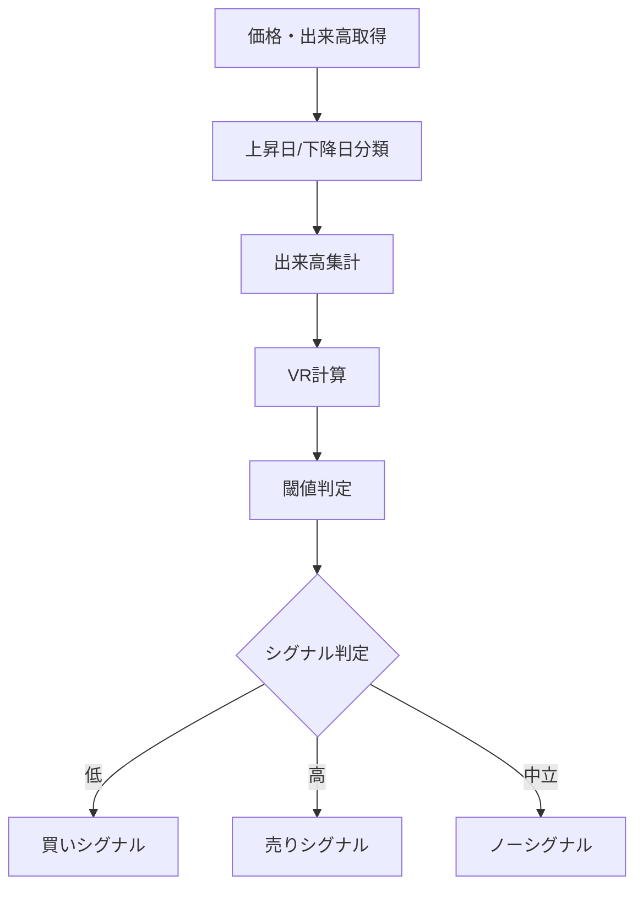

# VR（Volume Ratio）

## 概要
VR（Volume Ratio）は、一定期間における「上昇日の出来高」と「下降日の出来高」の比率から、買いと売りのエネルギー差を数値化するテクニカル指標です。
市場の勢いを「出来高ベース」で評価できます。

---

## この指標でわかること
- トレンド
  → 上昇出来高と下降出来高の偏りで方向性を判断

- 過熱感
  → VRが極端に高い/低い場合は過熱状態

- ボラティリティ
  → 出来高の偏りが大きいほど変動が強い

- 投資家心理
  → 買い勢力と売り勢力のエネルギー差

---

## 算出方法

### 計算式
VRは以下で計算されます。

VR = (上昇日の出来高 / 下降日の出来高) × 100

---

### 計算ステップ

① 期間を設定（例：25日）

② 日ごとに分類
- 上昇日 → 出来高を加算
- 下降日 → 出来高を加算

---

③ 合計を計算
- AV = 上昇日の出来高合計
- BV = 下降日の出来高合計

---

④ VRを計算

VR = (AV / BV) × 100

---

### 計算例

期間データ：

- 上昇日の出来高合計 = 30000
- 下降日の出来高合計 = 15000

---

VR = (30000 / 15000) × 100
VR = 2 × 100
VR = 200

---

### 結果の解釈
- 200 → 買い圧力強い
- 100 → 中立
- 70以下 → 売り圧力強い

---

## 基本的な見方
- VR > 150 → 買い優勢
- VR < 70 → 売り優勢
- VR ≈ 100 → 均衡状態

---

## チャートで見る代表的なシグナル

### 買いシグナル
- VRが70以下から上昇
→ 売り圧力低下・反発

---

### 売りシグナル
- VRが150以上から下降
→ 買い圧力低下・反落

---

### トレンド継続判定
- VRが100以上で安定
→ 上昇トレンド継続
- VRが100以下で安定
→ 下降トレンド継続

---

## 有効な相場
- 全般：有効
- トレンド相場：特に有効
- 出来高急変相場：有効

---

## 組み合わせると良い指標
- 出来高（必須）
- RSI（過熱感補助）
- MACD（方向性確認）
- OBV（資金流れ）

---

## Trade-Bot実装観点

### 必要データ
- 上昇日の出来高
- 下降日の出来高

### 算出頻度
- 1分足〜日足

### 実装難易度
- ★★☆☆☆（分類処理あり）

### シグナル化候補
- VR < 70 → 売られすぎ買い
- VR > 150 → 買われすぎ売り
- 100クロス → トレンド転換

---

## Mermaid図

