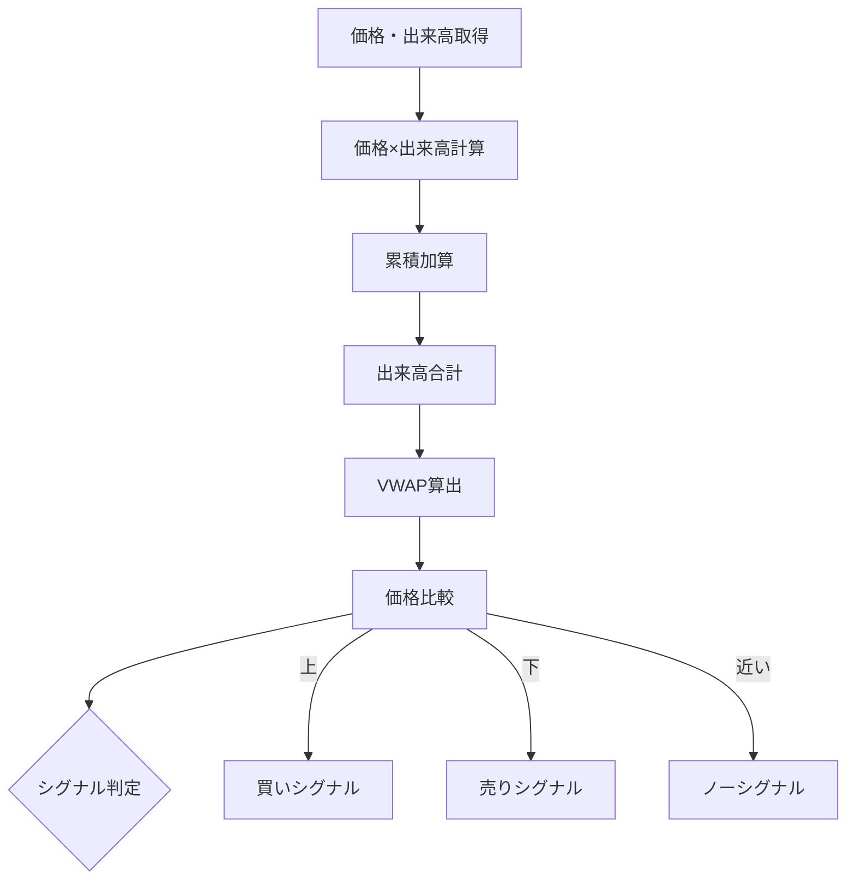

# VWAP（Volume Weighted Average Price）

## 概要
VWAP（出来高加重平均価格）は、出来高を加味して算出される「その日の平均取得価格」を示すテクニカル指標です。
機関投資家の売買基準としても使われる重要な価格ベンチマークです。

---

## この指標でわかること
- トレンド
  → 価格がVWAPより上か下かで方向性を判断

- 過熱感
  → VWAPからの乖離で買われすぎ・売られすぎを判断

- ボラティリティ
  → VWAPからの距離変化で値動きの強さを把握

- 投資家心理
  → 「平均取得価格に対して利益か損失か」を可視化

---

## 算出方法

### 計算式
VWAP = Σ(価格 × 出来高) ÷ Σ(出来高)

---

### 計算ステップ

① 各価格帯で
- 価格 × 出来高 を計算

② 合計を取る
- 分子：Σ(価格 × 出来高)
- 分母：Σ(出来高)

③ 割り算でVWAP算出

---

### 計算例

| 価格 | 出来高 | 価格×出来高 |
|------|--------|--------------|
| 100  | 1000   | 100000       |
| 105  | 2000   | 210000       |
| 110  | 1500   | 165000       |

---

分子：
100000 + 210000 + 165000 = 475000

分母：
1000 + 2000 + 1500 = 4500

---

VWAP = 475000 ÷ 4500
VWAP = 105.56

---

### 結果の解釈
- 現在価格 > VWAP → 買い優勢
- 現在価格 < VWAP → 売り優勢
- VWAP付近 → 方向感なし

---

## 基本的な見方
- VWAP上 → 強気相場
- VWAP下 → 弱気相場
- VWAP乖離大 → 反発・反落警戒

---

## チャートで見る代表的なシグナル

### 買いシグナル
- 価格がVWAPを下から上に突破
→ 強い買い圧力

---

### 売りシグナル
- 価格がVWAPを上から下に割る
→ 売り圧力増加

---

### トレンド継続判定
- VWAP上で推移
→ 上昇トレンド継続
- VWAP下で推移
→ 下降トレンド継続

---

## 有効な相場
- デイトレ：非常に有効
- トレンド相場：有効
- レンジ相場：ブレイク判断に有効

---

## 組み合わせると良い指標
- 出来高（必須）
- RSI（過熱感）
- MACD（方向性）
- Pivot Point（節目判断）

---

## Trade-Bot実装観点

### 必要データ
- 価格
- 出来高
- 時系列データ（当日リセット）

### 算出頻度
- リアルタイム（当日累積）

### 実装難易度
- ★★★☆☆（累積計算＋リセット処理）

### シグナル化候補
- VWAP上抜け → 買い
- VWAP下抜け → 売り
- VWAP乖離拡大 → 逆張り警戒

---

## Mermaid図

